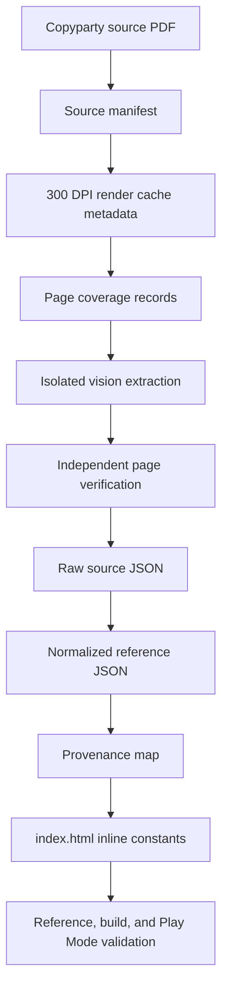

# feat: Verified extraction and attestation chain

## Summary

Build a source-attestable extraction pipeline that keeps source PDFs and rendered page images outside git, commits only portable manifests and verified source JSON, and proves that app-facing facts in `index.html` trace back through `references/` to source/page/block evidence. The plan preserves the single-file app architecture while replacing weak OCR/LLM-era authority data with vision-only, independently verified records for AiG, CSE, Waha, Bird in Hand, and Monster Island.

---

## Problem Frame

The repository already treats `PDF/source artifact -> references/*.json -> inline constants in index.html -> UI` as the data chain, but existing authority files still mix portable citations, local source paths, OCR-era extraction notes, `UNVERIFIED` placeholders, and inline constants that can drift from reference JSON. The external session plan tightens that chain: source PDFs stay on Loving Kypris Copyparty, page evidence is regenerated into ignored caches, source-derived records are vision-only, and every displayed/app-facing fact must validate back to committed JSON provenance.

---

## Assumptions

*This plan was authored from a session plan and repo research without a separate brainstorm document. The items below are implementation assumptions that should stay visible during execution.*

- Vision-only extraction is the intended future authority for the listed external sources, even where older repo docs allowed `pdftotext`, OCR, or pdfplumber text-layer extraction.
- The plan should update or supersede earlier attestation guidance instead of silently diverging from `docs/adr/003-attestable-data-chain.md`.
- The current font-aware cult pipeline remains useful for comparison and validation, but committed source-authority facts from listed PDFs should be backed by vision/page verification.
- Execution should use Beads for task tracking; Decapod todo operations are superseded by `bd ...` workflow operations in this repo.
- Provenance enforcement in this plan is limited to governed sources and app-facing facts introduced, changed, or explicitly migrated by this plan; legacy Mythras Core and non-Waha cult data are inventoried and either migrated, superseded, or exempted rather than accidentally pulled into the acceptance gate. The inventory itself is fail-closed for tracked source-like files and exported app data constants: unknown additions must be classified before validation can pass.

---

## Requirements

- R1. Source PDFs are not committed; source manifests record canonical Copyparty URI/path, stable `source_revision_id`, SHA-256, size, page count, edition/version, page coverage, render contract, lifecycle status, and permission basis.
- R2. Rendered page images are not committed; they are regenerated into ignored local caches using canonical PNG 300 DPI settings and recorded render metadata.
- R3. Committed source data for AiG, CSE, Waha, Bird in Hand, and Monster Island is vision-only: no `pdftotext`, OCR, pdfplumber text extraction, or text-layer/table extraction may be used as the committed evidence source for these records.
- R4. AiG has page-level evidence records for every PDF page in the 212-page GenCon Preview source, using the 1-based PDF page index as canonical page ID and preserving block identity, type, region, ordering, hashes, and bounded excerpts without committing wholesale page transcriptions.
- R5. Non-AiG listed PDFs have all-page coverage manifests; detailed extracted facts are committed only for contributing pages, and non-contributing pages carry explicit exclusion reasons.
- R6. Each contributing page has an isolated extraction unit and an independent verification unit before normalized JSON can update.
- R7. Cult mechanics come only from current cult one-pagers; updated Waha one-pager data overrides older Waha records and stale duplicates.
- R8. CSE is authoritative for combat style definitions; AiG is authoritative for culture availability/context.
- R9. Committed app-facing and source-authority JSON contains no unresolved `UNVERIFIED`, placeholders, invalid missingness values, known garbled rune prefixes, or known OCR artifacts; schemas distinguish absent optional fields, `not_applicable`, `unknown`, and blocked/unverified states.
- R10. The 8 AiG cultures from pages 26-41 are normalized with supported aliases and source-backed culture/cult mappings.
- R11. God Forgot receives a complete no-cult default build; Lunar Seven Mothers remains a display grouping and resolves to individual `7 Mothers - ...` one-pagers unless a current aggregate one-pager exists.
- R12. At least one complete suggested character build per AiG culture validates end-to-end through `App.agent.buildCharacter` and Play Mode expectations.
- R13. `index.html` remains a single-file app with inline constants; the implementation extends provenance validation rather than switching to runtime JSON loading or full code generation.
- R14. Every app-facing fact changed or governed by this plan maps to committed source JSON and source/page/block provenance.
- R15. Repository workflow follows `AGENTS.md`/`.decapod/OVERRIDE.md`: Beads for task tracking, isolated Decapod worktrees for implementation, required proof gates before claiming done, and Copyparty sync for mirrored player-facing files.
- R16. Source revisions are immutable once accepted: source hash, render contract, extractor prompt/version, verifier identity, schema version, or derived-rule version changes invalidate downstream page, normalized, provenance, and inline acceptance until revalidated in the same changeset.
- R17. Vision extraction and verification use a declared execution mechanism with prompt/version capture, artifact locations, independence criteria, disagreement handling, and promotion protocol before any normalized source data is rewritten.

---

## Scope Boundaries

- Do not commit source PDFs, rendered PNGs, transient extraction scratch, or remote Copyparty staging artifacts.
- Do not introduce runtime JSON loading, a framework, a build step, or code generation that replaces the inline-constant app model.
- Do not broaden culture scope beyond the 8 AiG cultures without a new source decision.
- Do not treat decorative artwork as required page content; data-bearing diagrams, tables, captions, stat blocks, and sidebars are in scope.
- Do not use older Waha records when a current one-pager-backed record exists.
- Do not make rare/manual cults such as Arkat required defaults for God Forgot unless current one-pager evidence and product direction change.
- Do not make the new provenance gate fail unrelated legacy data until that file/path has been classified as governed-now or migrated into this plan.
- Do not commit full-page source transcriptions; committed evidence should be enough to re-verify against a locally rendered page, not replace the source.

### Deferred to Follow-Up Work

- CI/CD automation for the full vision extraction batch can follow after local validators and manifests are stable.
- Bulk publication of player source PDFs to Copyparty is separate unless implementation changes mirrored player-facing files.
- Broader UI redesign of build suggestion cards is out of scope unless needed to expose complete existing specs without drift.

---

## Context & Research

### Relevant Code and Patterns

- `index.html` is the runtime app and owns inline constants such as `SKILLS_DATA`, `COMBAT_STYLES_DATA`, `CULTURES_DATA`, `CULTS_DATA`, `CULTURE_CULT_MAP`, `MIRACLES_DATA`, `SORCERY_SPELLS`, `STARTING_SPIRITS`, `CULTURE_BUILDS`, and `CULTURE_MAGIC_PROFILES`.
- `test-chargen.js` already loads `index.html` in a VM-like harness and exports the app constants, making it the natural place to extend reference/provenance drift checks.
- `test-agent-api.mjs` exercises browser/agent API acceptance and is required when magic-system or build behavior changes.
- `scripts/ingest-cults.py` and `scripts/build-rune-map.py` are existing ingestion/validation surfaces, but the current cult pipeline is text/font-aware and must not become the committed evidence source for the new vision-only authority records.
- `references/aig-raw/`, `references/cse-raw/`, `references/cults-raw/`, `references/spirits-raw/`, `references/combat-styles.json`, `references/theism-miracles.json`, `references/pregen-concepts.json`, and `fixtures/` are the core source/normalized/build data surfaces.
- `docs/adr/003-attestable-data-chain.md` records the existing attestation chain but still permits OCR/text extraction and `UNVERIFIED`; this plan needs an ADR update or superseding ADR to document the stricter authority model.
- `docs/adr/004-language-homeland-mapping.md`, `docs/adr/005-placeholder-skill-disambiguation.md`, `docs/adr/ADR-0006-full-magic-system-coverage.md`, and `docs/adr/ADR-0007-hannu-house-rules.md` already occupy later ADR numbers; the new source-authority ADR should use the next non-conflicting number and update `docs/adr/README.md`.

### Institutional Learnings

- `docs/solutions/data-integrity/data-attestability-learnings.md` warns that unverified LLM extraction previously produced fabricated spell summaries, wrong formulas, wrong spirit stats, and unverifiable citations; the plan should prefer page-level vision verification and explicit source/page metadata.
- `docs/solutions/data-pipeline/aig-pdf-extraction-pattern.md` notes that PDF extraction naturally yields page-aligned chunks rather than domain-aligned data; the plan must include a transform/merge stage from page records into normalized JSON.
- `docs/solutions/architecture/cult-type-detection.md` shows that derived app fields should be validated from underlying source facts rather than copied blindly into authority records.
- `docs/solutions/rules/hannu-house-rules.md` reinforces separating raw source data from house-rule mappings so campaign adaptations remain reversible and auditable.
- `docs/solutions/design-patterns/shared-filter-helper-2026-05-19.md` argues for shared validation helpers/fixtures so runtime behavior and validation gates do not drift.

### External References

- No additional framework research is required for planning. The relevant technology stack is local: vanilla HTML, Node-based validation, Python ingestion scripts, Copyparty-hosted source files, and Decapod/Beads workflow constraints.

---

## Key Technical Decisions

- **Portable, immutable manifest layer first:** Source identity, `source_revision_id`, hashes, page counts, render contracts, lifecycle state, permission basis, and page coverage belong in committed JSON manifests before raw/domain records are rewritten. This gives every later unit a stable citation target and a machine-checkable invalidation root.
- **Schema contracts precede data population:** Manifest, page-work, page-evidence, normalized-record, provenance, missingness, and promotion schemas must exist before source batches start so independent agents do not invent incompatible interim JSON shapes.
- **Vision execution is explicit and auditable:** The extraction/verifier workflow may be manual-agent-driven or tool-assisted, but it must declare the vision mechanism, prompt/version IDs, artifact format, scratch/cache boundaries, verifier inputs, and rework behavior before source data changes.
- **Raw page records before normalized domain JSON:** AiG and other source records should first land as page/coverage/extraction/verification data, then transform into app-facing `references/*.json`. This follows the repository learning that page-aligned extraction and domain-aligned data are separate steps.
- **Minimal committed page evidence:** Page records should store block IDs, block type, reading-order index, bounding region, page/render hashes, field-level excerpts where necessary, and source refs. They should not become full-page text copies; schemas should define per-field, per-block, per-page, and per-source excerpt budgets plus hash/region-only fallbacks.
- **Renderer contract is a dependency:** The renderer backend, version capture, arguments, DPI, package/runtime expectations, and mismatch behavior must be recorded. A different renderer/version or render contract invalidates dependent page evidence until rerendered and reverified.
- **Independent verification is a gate, not metadata decoration:** Normalized records cannot update from a contributing page until an independent verifier agrees with the extraction record. The verifier should work from the rendered page plus schema, not from the extractor's output or scratchpad, and verifier tool/model/prompt/version must be recorded.
- **Atomic promotion across layers:** A governed app-facing fact is accepted only when raw evidence, normalized record, provenance map, and inline constant validate together in one changeset through a single promotion protocol with source/fact ownership, base-tree hash checks, and stale-update rejection.
- **Provenance maps validate facts, not just files:** `index.html` constant parity should be checked at value/path granularity using stable fact IDs, canonical JSON serialization, value hashes, `source_revision_id`, source refs, normalized paths, and derived-rule/version metadata so a record cannot pass merely because a source file exists.
- **Derived and house-rule values remain separate from source facts:** Source records attest what the PDF/one-pager shows; deterministic classifiers, display groupings, aliases, and house-rule transformations cite their inputs and remain auditable as derived records.
- **ADR-003 must be revised or superseded by a non-conflicting ADR:** The new vision-only rule intentionally changes accepted extraction authority, so documentation must make the stricter decision explicit and keep `docs/adr/README.md` current.
- **Beads owns work tracking:** Execution planning and fan-out should create/claim/close Beads items and avoid new `decapod todo ...` task tracking, while still using Decapod worktrees and validation gates where required by the control plane.
- **Copyparty has separate source and player-facing roles:** Manifest URIs may point to canonical source/archive locations, while `/w/sources/books/` is a player-visible mirror governed by the publish rules. The plan must not assume every canonical source URI is public or every player-facing PDF is the canonical source revision. The live URI is a locator; `source_revision_id` plus SHA-256 is the authority, and unavailable sources require recovery state rather than silent acceptance.

---

## Open Questions

### Resolved During Planning

- **Should source PDFs be committed?** No. Store canonical Copyparty URI/path, hash, size, page count, and local hints in manifests; keep source PDFs and rendered images out of git.
- **Should `index.html` switch to runtime JSON loading?** No. Preserve inline constants and add provenance/drift validation.
- **What is canonical page identity for AiG?** The 1-based PDF page index is canonical; visible printed page labels are secondary metadata.
- **How should Waha precedence work?** Current one-pager-backed Waha data overrides older Waha records; duplicate/stale records are either removed or explicitly marked superseded during reconciliation.

### Deferred to Implementation

- **Exact manifest filenames and schema helper names:** The proposed layout is stable enough for planning, but exact helper/module names can be adjusted to match implementation ergonomics.
- **Exact Copyparty source URIs for CSE and Waha:** Execution must inspect the live Copyparty tree before committing canonical URIs.
- **Exact page counts and rendered image dimensions:** AiG is fixed by this plan at 212 pages; non-AiG page counts and render dimensions are determined by hashing/rendering the actual source PDFs during implementation.
- **Final source coverage exclusions for non-AiG pages:** Each non-contributing page needs an implementation-time classification and exclusion reason.
- **Exact renderer backend:** Implementation may choose the renderer available in this environment, but must lock the backend/version/args in manifests and treat mismatches as invalidating changes.

---

## Output Structure

    references/
      sources/
        manifest.json
        schema.json
        pages/
          aig.json
          bird-in-hand.json
          cse.json
          monster-island.json
          waha.json
      aig-raw/
        pages/
          page-001.json
          ...
        page-index.json
      cse-raw/
        pages/
        combat-styles-cse.json
      cults-raw/
        praxian/
          waha.json
      spirits-raw/
        bird-in-hand.json
        monster-island.json
      provenance/
        schema.json
        legacy-disposition.json
        index-html-map.json
        validation-report.json
    scripts/
      source_manifest_validator.js
      render_source_pages.py
      validate_provenance.js

This tree is a scope declaration, not a rigid implementation constraint. The implementing agents may refine exact filenames if they preserve the manifest/raw/normalized/provenance separation.

---

## High-Level Technical Design

> *This illustrates the intended approach and is directional guidance for review, not implementation specification. The implementing agent should treat it as context, not code to reproduce.*

---

## Implementation Units

### U1. Document strict source authority and workflow rules

**Goal:** Make the stricter vision-only data authority and Beads-first workflow explicit before implementation rewrites data.

**Requirements:** R3, R15

**Dependencies:** None

**Files:**
- Modify: `docs/adr/003-attestable-data-chain.md`
- Create: `docs/adr/008-vision-source-authority.md`
- Modify: `docs/adr/README.md`
- Modify: `.decapod/OVERRIDE.md`
- Test: documentation consistency via Decapod validation

**Approach:**
- Add or supersede an ADR stating that listed committed external-source data must be vision/page verified and cannot use text-layer extraction as committed evidence.
- Keep ADR-003's core attestation chain but update the extraction authority model so future agents do not follow stale OCR-era rules.
- Use the next non-conflicting ADR number and update the ADR index; explicitly mark whether ADR-003 is amended in place or superseded by the new ADR.
- Preserve the existing `.decapod/OVERRIDE.md` Beads guidance and the new rule that `decapod todo ...` task tracking is superseded by `bd ...` operations.

**Patterns to follow:**
- `docs/adr/003-attestable-data-chain.md`
- `.decapod/OVERRIDE.md`

**Test scenarios:**
- Test expectation: none -- documentation/workflow clarification only.

**Verification:**
- A reader can identify the current source authority rule without reconciling contradictory ADR/override guidance.
- Decapod documentation validation accepts the updated override/ADR set.

---

### U11. Inventory source artifacts and legacy authority disposition

**Goal:** Classify existing PDFs, generated artifacts, templates, fixtures, and legacy authority records before ignore rules or validation gates change.

**Requirements:** R1, R9, R14, R16

**Dependencies:** U1

**Files:**
- Create: `references/provenance/legacy-disposition.json`
- Test: `test-chargen.js`

**Approach:**
- Inventory tracked and local source-like files and classify each as source PDF, player-facing PDF, generated artifact, template/app asset, handout, normalized authority JSON, raw legacy JSON, fixture, or out-of-scope legacy data.
- Treat tracked repo files and known committed data surfaces as required disposition scope. Treat local-only artifacts as advisory discovery unless they become manifest inputs.
- Assign each legacy data surface a disposition: governed-now, migrate-in-this-plan, superseded, exempt/out-of-scope, or must-fix-before-acceptance.
- Distinguish source PDFs that should be untracked/manifested from non-source app assets such as sheet templates and player-facing handouts.
- Use this disposition table to scope validation gates so they do not accidentally fail the whole repository or silently bless stale app-facing data.

**Patterns to follow:**
- `.gitignore`
- `references/cults-upstream/`
- `references/spirits-raw/monster-island.json`
- `references/aig-raw/README.md`
- `fixtures/`

**Test scenarios:**
- Happy path: every tracked PDF/source-like artifact and exported app data constant is classified with disposition and rationale.
- Happy path: a non-governed legacy constant fixture proves provenance validation does not fail unrelated legacy data solely because it is exported.
- Edge case: a non-source app asset such as a sheet template is retained without being forced into source-manifest validation.
- Error path: a governed-now JSON file containing `UNVERIFIED` or known OCR artifacts fails unless explicitly superseded or exempted.
- Integration: provenance validation uses the disposition table to enumerate governed files and app constant paths.

**Verification:**
- Implementers know which legacy files are migrated, superseded, exempt, or retained before touching ignore rules or broad validators.
- No source PDF is removed, ignored, or untracked without an explicit classification.

---

### U12. Define shared schema contracts and validator skeletons

**Goal:** Establish canonical contracts for source revisions, page-work state, page evidence, provenance maps, missingness, and atomic promotion before any source batch invents data shapes.

**Requirements:** R1, R2, R4, R5, R6, R9, R14, R16

**Dependencies:** U1, U11

**Files:**
- Create: `references/sources/schema.json`
- Create: `references/provenance/schema.json`
- Create: `scripts/source_manifest_validator.js`
- Create: `scripts/validate_provenance.js`
- Modify: `test-chargen.js`

**Approach:**
- Define required fields for source manifest records, page coverage records, page evidence records, normalized provenance refs, derived-rule refs, and validation report metadata.
- Add lifecycle states for source revisions (`active`, `superseded`, `retired`, `unavailable`, `hash_mismatch`, `permission_pending`) and page work (`pending`, `blocked`, `rendered`, `extracted`, `verification_failed`, `needs_reextract`, `conflict`, `verified`, `normalized`, `accepted`, `stale`, `invalidated`, `superseded`).
- Define `source_revision_id` derivation from source ID, canonical locator, SHA-256, and acquisition timestamp; treat live Copyparty URI as a locator, not authority.
- Make invalidation rules explicit: source hash, render contract, extractor prompt/version, verifier identity, schema version, or derived-rule version changes reset dependent acceptance.
- Define canonical JSON serialization/value hashing and stable fact IDs for provenance checks.
- Define fact-ID namespace ownership, base-tree hash checks, and a single promotion protocol so parallel agents cannot merge stale raw/normalized/provenance/index updates.
- Define field-level missingness semantics (`absent_optional`, `not_applicable`, `unknown`, `blocked`, `unverified`) and where each is permitted.
- Define page excerpt budgets and fallback modes: max characters per field/block/page/source, and when long prose must use hash+region evidence only.
- Treat committed `references/provenance/validation-report.json` as regenerated evidence unless it records input-tree hashes and validator/tool versions.

**Patterns to follow:**
- Reference drift checks in `test-chargen.js`
- `docs/solutions/design-patterns/shared-filter-helper-2026-05-19.md`
- `docs/solutions/data-integrity/data-attestability-learnings.md`

**Test scenarios:**
- Happy path: schema-valid source, page, and provenance records pass with stable `source_revision_id`, fact IDs, and value hashes.
- Edge case: a legitimate missing value marked `not_applicable` passes where the schema allows it.
- Error path: a source hash change marks dependent page/normalized/provenance records stale or invalid until regenerated.
- Error path: a provenance entry using non-canonical value serialization fails deterministically.
- Integration: the Node harness enumerates expected governed/migrated constant paths from `legacy-disposition.json` and validates coverage rather than checking only entries already present in the provenance file.
- Integration: unknown exported app data constants or normalized authority files fail classification until marked governed, migrated, superseded, exempt, or out-of-scope.

**Verification:**
- Later implementation units can reuse one schema/state-machine vocabulary.
- Validators fail with source ID, source revision, file path, JSON path, fact ID, and invalid lifecycle/missingness reason.

---

### U2. Add source manifests and git hygiene for external sources

**Goal:** Establish portable committed source identity records while keeping PDFs, rendered pages, and transient extraction artifacts out of git.

**Requirements:** R1, R2, R5, R15

**Dependencies:** U1, U11, U12

**Files:**
- Create: `references/sources/manifest.json`
- Create: `references/sources/pages/aig.json`
- Create: `references/sources/pages/cse.json`
- Create: `references/sources/pages/waha.json`
- Create: `references/sources/pages/bird-in-hand.json`
- Create: `references/sources/pages/monster-island.json`
- Modify: `.gitignore`
- Test: `test-chargen.js`

**Approach:**
- Inspect the live Copyparty tree before recording canonical source paths.
- Record source URI/path, local hint, `source_revision_id`, SHA-256, size, page count, edition/version, lifecycle status, precedence notes, permission basis, and render contract for each source.
- Represent source acquisition failures explicitly (`unavailable`, `hash_mismatch`, `permission_pending`, `superseded`) and block rendering/extraction unless canonical hash and permission basis are valid.
- Add all source PDFs, rendered page images, and extraction scratch/cache directories to `.gitignore`.
- After a governed source PDF has a Copyparty manifest and retained local hint, untrack it with a clear commit boundary, keep local copies ignored, and record any legacy/player-facing/template exemptions in the disposition table.
- Add manifest validation to the existing Node test harness so missing required fields, mutable local-only paths, and invalid lifecycle states fail early.

**Execution note:** Characterize current tracked source artifacts before changing ignore rules, because `.gitignore` will not untrack files that are already committed.

**Patterns to follow:**
- `references/cse-raw/combat-styles-cse.json`
- `references/meta/aig-page-map.md`
- `test-chargen.js`

**Test scenarios:**
- Happy path: a manifest entry with canonical URI/path, `source_revision_id`, SHA-256, size, page count, render contract, lifecycle status, and permission basis passes validation.
- Edge case: a manifest entry with a machine-local absolute source path and no canonical URI/path fails validation.
- Edge case: a source listed as `permission_pending` is allowed in inventory but blocks render/extraction/normalization.
- Error path: a manifest entry missing `sha256`, `page_count`, or `render_contract` fails with the source ID and missing field.
- Integration: all page coverage files reference source IDs that exist in `references/sources/manifest.json`.

**Verification:**
- Every listed source has a portable manifest record and page coverage file stub.
- Governed tracked source PDFs with accepted manifests are untracked/ignored, or explicitly exempted with rationale when untracking is deferred.
- Git status shows no generated PDF/image/cache artifacts staged by this unit.

---

### U3. Build deterministic render and page-work tracking

**Goal:** Provide a repeatable way to render source pages into ignored cache images and track each page through extraction, verification, normalization, and acceptance.

**Requirements:** R2, R4, R5, R6

**Dependencies:** U2, U12

**Files:**
- Create: `scripts/render_source_pages.py`
- Create: `scripts/source_page_work_manifest.py`
- Modify: `references/sources/pages/aig.json`
- Modify: `references/sources/pages/cse.json`
- Modify: `references/sources/pages/waha.json`
- Modify: `references/sources/pages/bird-in-hand.json`
- Modify: `references/sources/pages/monster-island.json`
- Test: `test-chargen.js`

**Approach:**
- Render source pages as PNG at 300 DPI into an ignored cache path derived from source ID and PDF page number.
- Record renderer name/version/args, cache path pattern, image hash, and dimensions policy in page coverage records.
- Track page status through the shared lifecycle, including blocked/acquisition-failure states, render mismatch, verifier disagreement, re-extraction, conflict, stale/invalidated, normalized, and accepted states.
- Retain failed extraction/verification records for audit when practical, but block promotion until a later extraction and independent verifier resolve the conflict.
- Keep the manifest resumable so a long all-page AiG extraction can proceed in batches.

**Patterns to follow:**
- Existing Python scripts under `scripts/`
- `references/meta/aig-page-map.md`

**Test scenarios:**
- Happy path: rendering a known source page records cache path, image hash, dimensions, renderer version, and status `rendered`.
- Edge case: re-rendering the same page with the same contract leaves stable metadata or reports a deterministic mismatch.
- Error path: changing DPI/renderer args from the manifest contract fails validation rather than silently accepting mixed render settings.
- Error path: verifier disagreement moves the page to `verification_failed` or `conflict` and prevents normalization.
- Integration: a page cannot transition to `normalized` or `accepted` until extraction and independent verification metadata are present.

**Verification:**
- Render caches are reproducible locally and remain ignored by git.
- Page-work manifests can resume after partial completion without losing completed page statuses.

---

### U4. Implement vision-only page record and provenance validation

**Goal:** Implement the shared JSON contracts for page evidence, derived facts, verification evidence, normalized record provenance, and inline fact mapping.

**Requirements:** R3, R4, R5, R6, R9, R14

**Dependencies:** U2, U3, U12

**Files:**
- Modify: `scripts/source_manifest_validator.js`
- Modify: `scripts/validate_provenance.js`
- Create: `references/provenance/index-html-map.json`
- Create: `references/provenance/validation-report.json`
- Modify: `test-chargen.js`

**Approach:**
- Validate page records with `source_id`, `source_revision_id`, `pdf_page`, `printed_page_label`, ordered block evidence, derived facts, extraction metadata, and machine-checkable verifier independence.
- Support block types such as `heading`, `paragraph`, `table`, `stat_block`, `sidebar`, `caption`, and `page_label`, but store bounded evidence rather than whole-page transcription.
- Require app-facing provenance records to include stable fact ID, constant name, path, canonical value hash, source revision refs, normalized file/path, derived-rule/version metadata when applicable, and status.
- Fail validation for unresolved `UNVERIFIED`, placeholders, invalid missingness, known garbled rune prefixes, and known OCR artifacts in governed authority files.

**Patterns to follow:**
- Reference drift checks in `test-chargen.js`
- `docs/solutions/design-patterns/shared-filter-helper-2026-05-19.md`

**Test scenarios:**
- Happy path: a verified page record with ordered block IDs/regions/hashes, derived fact links, source revision, and independent verifier metadata passes validation.
- Edge case: a non-contributing page with `contributes: false` and an exclusion reason passes coverage validation without requiring detailed extracted facts.
- Edge case: a long prose block records a hash/region and bounded excerpt rather than full text.
- Error path: a contributing page without independent verifier metadata fails validation.
- Error path: a normalized/app-facing record containing `UNVERIFIED`, a placeholder value, invalid missingness, or a known garbled rune prefix fails with a targeted path.
- Integration: a provenance map entry resolves to an existing normalized file, normalized path, source ID, PDF page, and block ID.

**Verification:**
- Existing test harness can validate manifest/page/provenance contracts without introducing a build step.
- Failed provenance validation reports actionable source IDs and JSON paths.

---

### U14. Define the vision extraction and verification workflow

**Goal:** Make the vision-only extraction mechanism executable and auditable before source-specific batches begin.

**Requirements:** R3, R6, R16, R17

**Dependencies:** U3, U4, U12

**Files:**
- Create: `scripts/vision_page_workflow.py`
- Create: `references/sources/vision-workflow.json`
- Modify: `references/sources/schema.json`
- Modify: `references/provenance/schema.json`
- Test: `test-chargen.js`

**Approach:**
- Declare whether extraction/verification is manual-agent-driven, tool-assisted, or both, and record the accepted artifact shapes either way.
- Define extractor prompt/version IDs, verifier prompt/version IDs, tool/model identity fields, rendered-page inputs, scratch/cache locations, and committed output boundaries.
- Require verifier independence: the verifier works from rendered page image plus schema and source manifest metadata, not from extractor output, extractor scratchpad, or extractor rationale.
- Define disagreement handling: failed verification records remain auditable, page state moves to `verification_failed`, `needs_reextract`, or `conflict`, and normalization is blocked until an accepted re-extraction/reverification resolves it.
- Define sampled adversarial checks for large batches so independent verification is not only a same-path rubber stamp.

**Patterns to follow:**
- `references/sources/schema.json`
- `references/provenance/schema.json`
- `docs/solutions/data-integrity/data-attestability-learnings.md`

**Test scenarios:**
- Happy path: an extraction artifact and independent verification artifact for the same rendered page satisfy prompt/version/tool identity and source revision requirements.
- Edge case: a verifier can view the rendered page and schema but not extractor scratch/rationale, and the validator accepts this as independent.
- Error path: verifier and extractor share the same run ID, prompt context, or scratch artifact and fail independence validation.
- Error path: verifier disagreement blocks normalization and records rework state.
- Integration: source-specific page records in later units cannot enter `verified` without conforming workflow artifacts.

**Verification:**
- Execution agents have a concrete workflow for producing machine-checkable vision extraction and verification outputs.
- The plan can fan out page work without losing verifier independence or artifact consistency.

---

### U5. Rebuild AiG all-page raw records and culture authority

**Goal:** Replace weak AiG authority data with verified all-page records and normalized culture/magic profiles for the 8 AiG cultures.

**Requirements:** R3, R4, R6, R8, R9, R10, R14

**Dependencies:** U3, U4, U14

**Files:**
- Create: `references/aig-raw/pages/page-001.json`
- Create: `references/aig-raw/pages/page-002.json`
- Modify/create as needed: `references/aig-raw/pages/page-003.json` through `references/aig-raw/pages/page-212.json`
- Modify: `references/aig-raw/page-index.json`
- Modify: `references/aig-raw/cultures.json`
- Modify: `references/aig-raw/culture-magic-profiles-aig.json`
- Modify: `references/aig-raw/folk-magic-aig.json`
- Modify: `references/aig-raw/rune-magic-aig.json`
- Modify: `references/aig-raw/spirit-magic-aig.json`
- Modify: `references/provenance/index-html-map.json`
- Test: `test-chargen.js`

**Approach:**
- Treat every AiG PDF page as a required page record, even when it contributes no app data.
- Preserve page evidence for all pages using block IDs, block types, ordering, regions, hashes, and bounded excerpts; derive normalized culture, folk magic, rune magic, spirit magic, and culture magic profile facts only from verified page records.
- Normalize the 8 AiG cultures and supported aliases without expanding culture scope.
- Keep cult association data limited to AiG availability/context and one-pager-backed cult mechanics.

**Execution note:** Run the all-page AiG extraction in resumable batches; do not hand-edit normalized culture records without source page refs.

**Patterns to follow:**
- `references/aig-raw/README.md`
- `references/aig-raw/cultures.json`
- `docs/solutions/data-pipeline/aig-pdf-extraction-pattern.md`

**Test scenarios:**
- Happy path: every AiG PDF page from 1 through 212 has a page record with source ID, PDF page, page label metadata, blocks or exclusion, extraction metadata, and verifier metadata.
- Happy path: each of the 8 AiG cultures resolves to canonical normalized records and supported aliases.
- Edge case: visible printed page labels that differ from PDF page numbers are stored as secondary metadata without changing canonical page ID.
- Edge case: long prose or whole-page content is represented by region/hash/bounded excerpt evidence rather than committed full-page transcription.
- Error path: an AiG-derived normalized culture skill/magic/passions fact without a source page/block reference fails validation.
- Integration: `CULTURES_DATA` and `CULTURE_MAGIC_PROFILES` facts in `index.html` map back to verified AiG source records.

**Verification:**
- AiG page coverage is complete for all 212 PDF pages.
- Normalized AiG culture/magic JSON is free of placeholders, OCR artifacts, and unverified values.

---

### U6. Refresh Waha and reconcile cult one-pager authority

**Goal:** Re-extract Waha from the current one-pager, establish canonical Waha precedence, and prevent stale duplicate Waha data from reaching the app.

**Requirements:** R3, R5, R6, R7, R9, R11, R14

**Dependencies:** U3, U4, U14

**Files:**
- Modify: `references/sources/manifest.json`
- Modify: `references/sources/pages/waha.json`
- Modify: `references/cults-raw/praxian/waha.json`
- Modify or remove/supersede: `references/cults-raw/storm/waha.json`
- Modify: `references/cults-raw/cults.json`
- Modify: `references/theism-miracles.json`
- Modify: `references/provenance/index-html-map.json`
- Test: `scripts/ingest-cults.py`
- Test: `test-chargen.js`
- Test: `test-agent-api.mjs`

**Approach:**
- Locate the current Waha one-pager source and record it in the manifest/page coverage files.
- Classify every Waha page as contributing/non-contributing and record exclusion reasons for non-contributing pages.
- Extract and verify Waha facts through the same vision/page verification contract as other listed sources.
- Choose one canonical normalized Waha location and explicitly remove, redirect, or mark stale duplicate records so app data cannot use older Waha mechanics.
- Preserve one-pager-only cult mechanics authority while allowing AiG to provide culture/cult association context.

**Patterns to follow:**
- `references/cults-raw/praxian/waha.json`
- `references/cults-raw/storm/waha.json`
- `scripts/ingest-cults.py`

**Test scenarios:**
- Happy path: Waha cult skills, miracles, folk magic, requirements, and metadata cite the current one-pager source/page/block refs.
- Happy path: every Waha page has page coverage, and non-contributing pages carry exclusion reasons.
- Edge case: duplicate Waha records resolve to the canonical Praxian Waha record or an explicit supersession marker.
- Error path: a stale Waha source version or missing verifier metadata fails validation.
- Edge case: source wording such as `Navigation` or `Tracking` is preserved in Waha source facts and handed to U13 for app-facing canonicalization.
- Integration: `CULTS_DATA`, `CULTURE_CULT_MAP`, and `MIRACLES_DATA` Waha-related entries in `index.html` match the canonical one-pager-backed normalized record.

**Verification:**
- Updated Waha data overrides older Waha records and passes cult/reference validation.
- No stale Waha duplicate can be selected by app-facing data.

---

### U7. Retrofit CSE, Bird in Hand, and Monster Island into the attestation chain

**Goal:** Bring combat style and spirit authority data under the same source manifest, page coverage, extraction, verification, and provenance validation model.

**Requirements:** R1, R3, R5, R6, R8, R9, R14

**Dependencies:** U3, U4, U14

**Files:**
- Modify: `references/sources/manifest.json`
- Modify: `references/sources/pages/cse.json`
- Modify: `references/sources/pages/bird-in-hand.json`
- Modify: `references/sources/pages/monster-island.json`
- Modify: `references/cse-raw/combat-styles-cse.json`
- Modify: `references/combat-styles.json`
- Modify: `references/spirits-raw/bird-in-hand.json`
- Modify: `references/spirits-raw/monster-island.json`
- Modify: `references/provenance/index-html-map.json`
- Test: `test-chargen.js`

**Approach:**
- Replace machine-local CSE source paths with portable source manifest references.
- Classify every source page as contributing/non-contributing and extract detailed facts only for contributing pages.
- Keep CSE as the definition authority for combat styles while preserving AiG as culture availability/context.
- Move Monster Island from `verified: false`/`UNVERIFIED` style metadata to verified contributing-page evidence before it can act as source authority.

**Patterns to follow:**
- `references/cse-raw/combat-styles-cse.json`
- `references/combat-styles.json`
- `references/spirits-raw/bird-in-hand.json`
- `references/spirits-raw/monster-island.json`

**Test scenarios:**
- Happy path: a CSE combat style definition in `references/combat-styles.json` cites a verified CSE source page/block and preserves AiG availability as separate context.
- Happy path: Bird in Hand spirit records cite verified contributing pages and pass provenance validation.
- Edge case: non-contributing pages in CSE/Bird/Monster Island are represented with exclusion reasons and do not require detailed facts.
- Error path: Monster Island records with `verified: false`, `UNVERIFIED`, or missing source refs fail validation.
- Integration: `COMBAT_STYLES_DATA` and `STARTING_SPIRITS` facts in `index.html` map to normalized records and verified source/page/block refs.

**Verification:**
- CSE, Bird in Hand, and Monster Island have complete page coverage manifests.
- App-facing combat style and spirit facts are source-backed and artifact-clean.

---

### U13. Canonicalize aliases and derived app-facing names

**Goal:** Normalize source terminology needed by the 8 AiG builds and governed facts without hiding the source wording or creating unattested aliases.

**Requirements:** R9, R10, R11, R12, R14, R16

**Dependencies:** U5, U6, U7

**Files:**
- Create: `references/provenance/alias-map.json`
- Modify: `references/provenance/index-html-map.json`
- Modify: `references/pregen-concepts.json`
- Modify: `test-chargen.js`
- Test: `test-agent-api.mjs`

**Approach:**
- Define derived alias/canonicalization records only for culture labels, cult names, skill names, miracle names, folk magic spell names, combat style names, and source-specific display groupings consumed by the 8 AiG builds or governed AiG/CSE/Waha/Bird/Monster facts.
- Preserve source wording and cite the source fact behind each alias; record the derived rule/version that maps source wording to app canonical wording.
- Use the alias map to reconcile known handoff variants such as `Navigation`/`Navigate`, `Tracking`/`Track`, `Seven Mothers` display grouping, RQG-style terms in pregen concepts, and supported AiG culture aliases.
- Block app/build validation when a build or inline constant uses an alias that is not source-backed or declared as a derived rule.
- Defer global skill/spell/cult alias cleanup outside the governed source/build paths.

**Patterns to follow:**
- `references/pregen-concepts.json`
- `references/cults-raw/praxian/waha.json`
- `CULTURE_CULT_MAP` and `CULTURE_BUILDS` in `index.html`

**Test scenarios:**
- Happy path: supported culture aliases normalize to the 8 canonical AiG cultures while preserving source/display labels.
- Happy path: source skill variants map to app canonical skill names with provenance for the source wording and derived rule.
- Edge case: Lunar Seven Mothers remains a display grouping and resolves to individual one-pager-backed cult records.
- Error path: an undeclared RQG-style term or out-of-scope culture in a suggested build fails before `App.agent.buildCharacter` accepts it.
- Integration: alias records are used by `CULTURE_CULT_MAP`, suggested builds, and inline constant provenance validation.

**Verification:**
- App-facing canonical names are deterministic, source-backed, and separately auditable as derived values.
- Build validation failures identify whether the problem is source absence, alias absence, or invalid culture/cult availability.

---

### U8. Complete and validate source-backed AiG culture builds

**Goal:** Replace lightweight build suggestions with complete character specs for every AiG culture and cross-link UI suggestions to those valid specs.

**Requirements:** R10, R11, R12, R13, R14

**Dependencies:** U5, U6, U7, U13

**Files:**
- Modify: `references/pregen-concepts.json`
- Modify or create: `fixtures/balazaring.json`
- Modify or create: `fixtures/esrolian.json`
- Modify or create: `fixtures/god-forgot.json`
- Modify or create: `fixtures/lunar-heartland.json`
- Modify or create: `fixtures/lunar-provincial.json`
- Modify or create: `fixtures/praxian.json`
- Modify or create: `fixtures/sartarite-heortling.json`
- Modify or create: `fixtures/telmori-hsunchen.json`
- Modify: `index.html`
- Modify: `references/provenance/index-html-map.json`
- Test: `test-chargen.js`
- Test: `test-agent-api.mjs`

**Approach:**
- Define one complete valid character spec per AiG culture using only culture-attested skills, passions, folk magic, CSE-backed combat styles, and one-pager-backed cults where selected.
- Keep God Forgot's default complete build no-cult.
- Treat Lunar Seven Mothers as display grouping only and resolve builds to individual attested one-pager cults unless a current aggregate one-pager exists.
- Link Step 4 suggested cards to complete specs or derive card data from specs so suggestions cannot drift from buildable characters.
- Exercise all 8 complete builds through app-agent validation and Play Mode. Require PDF-export QA for each build only when `index.html`, PDF export, or template behavior changes; otherwise document why PDF export is unaffected.

**Execution note:** Add build acceptance coverage before changing `CULTURE_BUILDS` so invalid current suggestions are characterized.

**Patterns to follow:**
- Existing fixtures in `fixtures/`
- `references/pregen-concepts.json`
- `CULTURE_BUILDS` and `App.agent.buildCharacter` in `index.html`

**Test scenarios:**
- Happy path: each of the 8 AiG culture specs builds successfully through `App.agent.buildCharacter`.
- Happy path: God Forgot default build completes without a cult and passes Play Mode validation.
- Edge case: supported aliases normalize to canonical culture names before build validation.
- Edge case: Lunar Seven Mothers display labels do not create an unattested aggregate cult requirement.
- Error path: a build that selects a non-CSE combat style, an unattested cult, or an out-of-culture magic option fails with a clear validation path.
- Integration: Step 4 suggested build cards match the complete source-backed specs and remain valid after inline constant extraction.
- Integration: each of the 8 builds has either automated browser coverage or documented human-style agent-browser QA through Play Mode, with PDF export included when export/template behavior is in scope.

**Verification:**
- All 8 AiG cultures have complete, valid, source-backed build specs.
- Suggested UI builds cannot drift from fixtures/reference specs without a failing test.

---

### U9. Enforce inline provenance and app-data drift validation

**Goal:** Make every app-facing fact governed by this plan fail tests if it lacks source JSON provenance or drifts from normalized records.

**Requirements:** R9, R13, R14, R15

**Dependencies:** U4, U5, U6, U7, U8, U11, U13

**Files:**
- Modify: `test-chargen.js`
- Modify: `references/provenance/index-html-map.json`
- Modify: `references/provenance/validation-report.json`
- Modify: `index.html`
- Test: `test-chargen.js`
- Test: `test-agent-api.mjs`

**Approach:**
- Extend existing drift checks to verify stable fact IDs, canonical value hashes, source revision refs, derived-rule refs, and source refs for governed cultures, culture/cult map entries, Waha cult/miracle facts, CSE combat styles, Bird/Monster spirit facts, AiG folk/rune/spirit magic data, alias records, and suggested builds.
- Treat legacy Mythras Core, non-Waha one-pager, and other unclassified source families according to `references/provenance/legacy-disposition.json` rather than failing them under the new gate by accident.
- Keep validation in test scripts and committed provenance JSON; do not add runtime fetches to the app.
- Report mismatches by constant/path/source ref so implementing agents can fix the reference data or inline constant directly.
- Require raw evidence, normalized JSON, provenance map, and inline constants to advance together for governed app-facing facts.

**Patterns to follow:**
- Existing export/load pattern in `test-chargen.js`
- `docs/solutions/design-patterns/shared-filter-helper-2026-05-19.md`

**Test scenarios:**
- Happy path: each governed `index.html` constant path has a provenance entry with matching value hash and resolvable source refs.
- Edge case: derived display fields cite their source facts and derived rule rather than pretending to be direct PDF text.
- Edge case: an out-of-scope legacy path is exempt only when the disposition table declares the exemption and no governed inline constant depends on it.
- Error path: an inline constant value changed without matching normalized JSON/provenance update fails validation.
- Error path: a provenance source ref pointing to a missing source ID, page record, block ID, normalized file, or normalized path fails validation.
- Integration: provenance validation runs as part of the normal Node harness and covers the same app constants used by UI/build logic.

**Verification:**
- `index.html` remains self-contained.
- Provenance drift failures are actionable and cover all app-facing facts touched by the plan.

---

### U10. Acceptance, Copyparty sync, and publication proof

**Goal:** Prove the full implementation from the isolated worktree and publish any mirrored player-facing changes correctly.

**Requirements:** R12, R13, R15

**Dependencies:** U1, U11, U12, U2, U3, U4, U5, U6, U7, U13, U8, U9

**Files:**
- Modify as needed: `README.md`
- Modify as needed: `docs/handouts/source-trail.html`
- Test: repository proof gates

**Approach:**
- Run the required repository proof gates from the isolated Decapod worktree.
- Confirm `test-agent-api.mjs` preconditions before relying on it; if the app must be served for browser/API tests, document the setup/fallback used by the executing agents.
- Use human-style browser QA after any `index.html` changes: click/type/select changed choices for all 8 source-backed builds, use fresh DOM refs after re-render, inspect screenshots, and verify Play Mode. Include PDF export when PDF/export/template behavior changes.
- If mirrored files changed, inspect the live Copyparty tree, sync only the corresponding remote paths, and verify affected public URLs.
- Commit only verified work and include the required Copilot co-author trailer.

**Patterns to follow:**
- `.decapod/OVERRIDE.md`
- `AGENTS.md`
- Copyparty publish commands documented in the project override

**Test scenarios:**
- Happy path: required proof gates pass after source/reference/index changes.
- Integration: browser QA confirms all 8 source-backed builds work through Play Mode, and PDF export when export/template behavior is in scope.
- Error path: a mirrored file change is not considered complete until the corresponding Copyparty URL is verified.

**Verification:**
- `node test-chargen.js` passes.
- `node test-agent-api.mjs` passes after magic/build changes.
- `./scripts/ingest-cults.py --validate` passes after cult/reference changes or is superseded by an explicitly documented validator for the vision-only pipeline.
- `decapod validate` passes or any Decapod policy mismatch is tracked as a blocking Beads issue rather than claimed complete.
- Public URLs are verified for any synced mirrored files.

---

## System-Wide Impact

- **Interaction graph:** Source manifests feed page coverage, extraction records, normalized JSON, provenance maps, inline constants, app build validation, and browser QA.
- **Error propagation:** Validators should fail loudly with source ID, source revision, file path, JSON path, fact ID, and missing/invalid provenance rather than silently skipping incomplete records.
- **State lifecycle risks:** Long-running page extraction needs resumable status transitions; source/render/schema/extractor/verifier changes must invalidate dependent acceptance; partial batches must not update normalized records before independent verification.
- **API surface parity:** `App.agent.buildCharacter`, Play Mode, fixture validation, and suggested UI cards must agree on culture aliases, cult authority, combat style authority, and build completeness.
- **Integration coverage:** Unit-like schema checks are insufficient; build specs must exercise the app agent API and browser QA must exercise all 8 source-backed builds.
- **Copyparty boundary:** Canonical manifest URIs, private/archive source locations, and player-visible `/w/sources/books/` mirrors may differ; permission basis and public visibility must be explicit in manifests and publish steps.
- **Atomic promotion:** Governed raw evidence, normalized JSON, provenance maps, and inline constants should move together so no accepted app fact points at stale or mismatched evidence.
- **Unchanged invariants:** `index.html` stays single-file and inline-data based; source PDFs/render images stay outside git; Beads remains the durable task tracker.

---

## Risks & Dependencies

| Risk | Mitigation |
|------|------------|
| Vision-only extraction is slow and expensive for all AiG pages | Use resumable page-work manifests and independent per-page batches. |
| Older ADRs/scripts still imply OCR or text extraction is acceptable | Update/supersede ADR guidance in U1 and keep text/font-aware pipelines out of committed evidence authority for listed sources. |
| Existing tracked source PDFs conflict with the new "PDFs outside git" rule | Characterize tracked artifacts before changing `.gitignore`; untrack/migrate only with explicit commit boundaries. |
| Source records become too large or quote too much copyrighted text | Use block IDs, regions, hashes, and bounded excerpts rather than full-page transcription; keep source PDFs and rendered images outside git. |
| Copyparty source URI mutates after acceptance | Carry immutable `source_revision_id` and SHA-256 through every downstream record; invalidate dependent evidence when the manifest changes. |
| Verifier disagreement or partial verification is treated as success-shaped metadata | Model `verification_failed`, `needs_reextract`, and `conflict` states and block normalization until independence and agreement are machine-checkable. |
| Normalized JSON drifts from inline constants | Enforce value-hash provenance checks in `test-chargen.js`. |
| Duplicate Waha records continue to leak into app data | Establish one canonical Waha record and fail validation on stale duplicate use. |
| Decapod container-workspace validation mismatch blocks final validation | Track the mismatch as a Beads blocker if it persists; do not claim false validation success. |

---

## Documentation / Operational Notes

- Update ADR guidance before or alongside data rewrites so future agents do not follow stale OCR-era instructions.
- Update `docs/adr/README.md` when creating the source-authority ADR, and avoid reusing existing ADR numbers.
- Update `README.md` only if user-facing data authority, validation commands, or source policy documentation changes materially.
- Update `docs/handouts/source-trail.html` only if player-facing source trail content changes; if changed, sync it to Copyparty under `/w/rules/handouts/` and verify the public URL.
- Do not sync source PDFs or generated artifacts to player-visible Copyparty paths unless the task explicitly changes mirrored player files.
- If source manifests use non-public Copyparty/archive URIs, document the permission basis without exposing private-only URLs in player-facing handouts.

---

## Alternative Approaches Considered

- **Runtime-load JSON instead of inline constants:** Rejected because the project architecture and user decision keep `index.html` as a single-file vanilla app.
- **Keep deterministic text/font extraction as authority:** Rejected for the listed sources because the session plan explicitly requires vision-only committed evidence.
- **Commit rendered page images for auditability:** Rejected because source PDF hash plus deterministic render metadata is sufficient while keeping bulky/generated artifacts out of git.
- **Commit full page text for maximum auditability:** Rejected because it risks duplicating source material; region/hash/bounded-excerpt evidence is sufficient for re-verification.
- **Validate only file-level source presence:** Rejected because it would not prevent individual app-facing facts from drifting or losing page/block provenance.

---

## Success Metrics

- Every listed source has a source manifest and complete page coverage manifest.
- AiG has verified page records for all 212 PDF pages.
- Non-AiG listed PDFs classify every page and verify every contributing page before normalized facts update.
- No governed authority/app-facing JSON contains unresolved `UNVERIFIED`, placeholders, invalid missingness, garbled rune prefixes, or known OCR artifacts.
- Every governed inline constant path maps to normalized JSON and verified source revision/page/block refs using stable fact IDs and canonical value hashes.
- All 8 AiG culture builds validate end-to-end.
- Legacy data outside this plan has explicit governed/migrate/supersede/exempt disposition.

---

## Phased Delivery

### Phase 1: Authority and manifest foundation

- U1, U11, U12, U2, U3, U4, U14.

### Phase 2: Source data rebuilds

- U5, U6, U7.

### Phase 3: App-facing validation and builds

- U13, U8, U9.

### Phase 4: Acceptance and publication

- U10.

---

## Sources & References

- External session plan: "Verified extraction and attestation plan" provided by the user from Copilot session state.
- Project workflow and proof rules: `.decapod/OVERRIDE.md`, `AGENTS.md`
- Existing attestation ADR: `docs/adr/003-attestable-data-chain.md`
- Prior plans: `docs/plans/2026-05-17-005-fix-data-integrity-and-attestability.md`, `docs/plans/2026-05-18-002-feat-deterministic-cult-pdf-ingestion-plan.md`
- Institutional learnings: `docs/solutions/data-integrity/data-attestability-learnings.md`, `docs/solutions/data-pipeline/aig-pdf-extraction-pattern.md`, `docs/solutions/architecture/cult-type-detection.md`, `docs/solutions/rules/hannu-house-rules.md`, `docs/solutions/design-patterns/shared-filter-helper-2026-05-19.md`
- Current validation surfaces: `test-chargen.js`, `test-agent-api.mjs`, `scripts/ingest-cults.py`
- Current data surfaces: `index.html`, `references/aig-raw/`, `references/cse-raw/`, `references/cults-raw/`, `references/spirits-raw/`, `references/combat-styles.json`, `references/theism-miracles.json`, `references/pregen-concepts.json`, `fixtures/`
