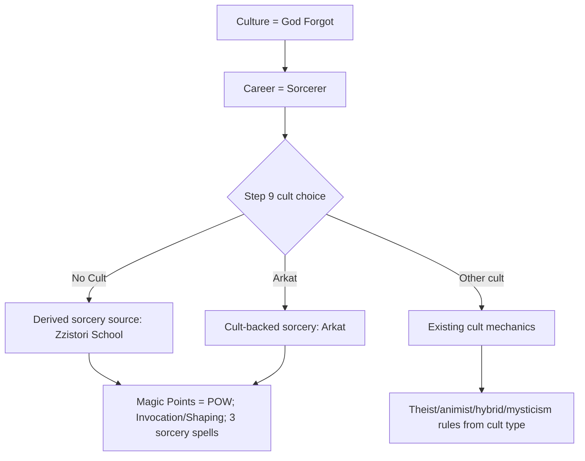

# feat: Add Zzistori School sorcery access

## Summary

Add a source-backed, non-cult sorcery path for God Forgot Zzistori Sorcerer characters. The implementation should model Zzistori as a culture-backed sorcery school/source, not as a theist cult, while preserving Arkat as a separate rare/manual sorcery cult option.

---

## Problem Frame

God Forgot currently has source text saying Zzistori sorcery is cultural and that gods are not worshipped, but the chargen's higher-magic flow is still cult-centric. That makes the supported God Forgot Sorcerer/No Cult path unable to express its RAW Mythras sorcery access without routing through Arkat or implying theist Devotion mechanics.

---

## Assumptions

*This plan was authored in pipeline mode without synchronous user confirmation. The items below are agent inferences that fill gaps in the input and should be reviewed during implementation and code review.*

- Zzistori sorcery access is automatic for the God Forgot + Sorcerer + No Cult path; this plan does not add a general school picker in v1.
- Selecting an explicit cult keeps using cult mechanics. Arkat remains an explicit rare/manual sorcery cult and does not become the default God Forgot sorcery route.
- Zzistori School uses the same chargen sorcery mechanics as existing RAW sorcery: Magic Points from POW, Invocation/Shaping, and a 3-spell starting picker.
- Zzistori school access should be derived from current character choices, not persisted as a second source of truth; selected spells should clear when prerequisites disappear, such as changing away from God Forgot, changing away from Sorcerer, or selecting a non-Zzistori explicit cult path.
- The implementation should avoid inventing a curated Zzistori-only spell list unless source evidence supports one; use the existing Mythras Core sorcery spell list for chargen selection unless page verification proves a narrower list.

---

## Requirements

- R1. Add characterization coverage for Bead `mythras-chargen-2yg7.6` that documents current God Forgot + Sorcerer + No Cult behavior, including Invocation/Shaping skill presence and the current absence/presence of sorcery selection.
- R2. Add source-backed Zzistori School reference data with page citations to AiG p.30-31 and p.59-60 for God Forgot/Zzistori culture sorcery and Mythras Core p.162 and p.166-177 for sorcery source types and spells.
- R3. Represent Zzistori as a culture-backed sorcery school/source, not as a cult entry and not as Arkat.
- R4. Let God Forgot + Sorcerer + No Cult access the sorcery spell picker, select up to 3 starting spells, and receive Magic Points from POW without Devotional Pool or theist miracles.
- R5. Keep Arkat available as its existing distinct sorcery cult option for God Forgot and preserve its current no-Devotional-Pool behavior.
- R6. Keep save/load/import/export, agent API state, Play Mode, and PDF output consistent for both cult-backed sorcery and derived source-backed Zzistori sorcery.
- R7. Preserve existing non-sorcery No Cult behavior for other cultures/careers and preserve existing theist, animist, hybrid, and Arkat regression coverage.
- R8. Maintain the attestable data chain: source page evidence -> reference JSON -> provenance map -> inline `index.html` constants -> UI/PDF/tests.
- R9. Complete project proof gates for magic changes: public tests, agent API tests, source/provenance validation, manual human-style browser QA, Decapod validation where the known workspace bug allows it, and Copyparty sync if mirrored files change.

---

## Scope Boundaries

- Do not turn Zzistori into a selectable cult or add it to `CULTURE_CULT_MAP` as a cult.
- Do not add Devotion, Devotional Pool, miracle selection, or Rune Magic access to the No Cult Zzistori path.
- Do not remove Arkat or merge Arkat into Zzistori.
- Do not create a general multi-school sorcery feature beyond the God Forgot Zzistori source required here.
- Do not invent spell-rune maps, Law Rune shaping claims, or unsupported Zzistori-only spell restrictions.
- Do not change non-God-Forgot No Cult behavior except where shared validation helpers must recognize the new source-backed path.

### Deferred to Follow-Up Work

- A general sorcery-school picker for future cultures, grimoires, mentors, or multiple schools is deferred until a source-backed need exists.
- Broad handout rewrites are deferred unless implementation reveals an existing player-facing claim that contradicts the new source-backed model.
- Full reconciliation of stale ADR wording about AiG sorcery adaptation beyond this Zzistori decision is deferred unless the ADR created/updated in this work needs to amend it narrowly.

---

## Context & Research

### Relevant Code and Patterns

- `index.html` is a single-file app with inline constants mirroring `references/*.json`.
- `detectCultType()` classifies cults from cult skill patterns: Devotion -> theist, Trance/Binding -> animist, Invocation/Shaping -> sorcery, Mysticism/Meditation -> mysticism.
- `CULTURE_CULT_MAP` lists God Forgot with no primary cults and secondary rare/manual cult options including Arkat.
- `CULTURE_MAGIC_PROFILES` already records God Forgot as atheist/secularist, with cultural Zzistori sorcery and Rune Magic unavailable.
- `CharacterData` currently stores cult-backed magic state with `cult`, `cultType`, `devotionalPool`, `boundSpiritSlots`, `boundSpirits`, `sorceryResource`, and `sorcerySpells`.
- `App.renderStep9()`, `App.selectCult()`, `App.clearCultMagicSelections()`, and `App.getStep9ValidationErrors()` are cult-centric today.
- `App.renderPlayMagic()`, `App.exportSinglePagePDF()`, and `App.agent.getMagicState()` render/query sorcery through the active cult type.
- `test-chargen.js` has source-sync and magic regression coverage, including culture magic profile sync and handout tests that forbid invented sorcery rune-map claims.
- `test-agent-api.mjs` currently uses God Forgot + Arkat as the sorcery acceptance example.

### Institutional Learnings

- `docs/solutions/architecture/cult-type-detection.md` supports keeping `detectCultType()` cult-only and skill-pattern based.
- `docs/solutions/design-patterns/spirit-sorcery-picker-pattern.md` says the sorcery picker should reuse the checkbox-with-limit pattern and store selections in `CharacterData.sorcerySpells`.
- `docs/solutions/data-integrity/data-attestability-learnings.md` requires source JSON and page citations before app-facing facts.
- `.rpi/diagnoses/arkat-sorcery-raw-invocation-shaping.md` and current handout tests warn against mapping sorcery to Rune Affinity/Law Rune claims.
- `docs/solutions/design-patterns/scroll-preservation-on-rerender-2026-05-19.md` applies to Step 9 re-rendering after spell toggles or source/cult changes.

### External References

- No web research is needed for this plan. The relevant authorities are local project ADRs, reference JSON, and source PDFs already identified by the project.

---

## Key Technical Decisions

- **Separate sorcery source from cult:** Add a source/school access model for Zzistori rather than overloading `cult`, because `detectCultType()` is intentionally a cult classifier and God Forgot Zzistori access is cultural/school-based.
- **Automatic God Forgot Sorcerer path:** Derive Zzistori access from God Forgot + Sorcerer + No Cult rather than adding a new v1 school picker, because the Bead is scoped to one source-backed build path.
- **Single sorcery picker state:** Reuse `CharacterData.sorcerySpells` and the existing 3-spell sorcery limit so Arkat and Zzistori share RAW sorcery selection mechanics.
- **Derived source resolver:** Do not persist a separate Zzistori source field unless implementation discovers a current second consumer that cannot use derivation; derive source access from culture, career, and cult choices so save/import state cannot drift from prerequisites.
- **Distinct display source:** UI, Play Mode, PDF, and agent API should display "Zzistori School" or equivalent as the sorcery source when cult is null, instead of pretending there is a cult label.
- **No theist resources:** Devotional Pool remains derived only from theist cult access; Zzistori source access sets no miracles and no Devotional Pool.
- **ADR-backed model change:** Record the culture-backed sorcery source decision in a new or amended ADR so future magic-system work does not re-collapse schools into cults.

---

## Open Questions

### Resolved During Planning

- Should Zzistori be represented as a cult? Resolved: no; it should be represented as a culture-backed sorcery school/source.
- Should the first implementation include a general school picker? Resolved: no; derive the Zzistori source for the scoped God Forgot Sorcerer/No Cult path.
- Should the No Cult Zzistori path use Devotional Pool? Resolved: no; it uses RAW sorcery Magic Points and Invocation/Shaping.
- Should Arkat remain available? Resolved: yes; Arkat stays a separate rare/manual sorcery cult.

### Deferred to Implementation

- Exact helper names for the derived source resolver are deferred until implementation can fit existing `CharacterData` and agent API conventions.
- Whether the existing Zzistori build spec has a misleading Devotion passion should be decided from source evidence while updating the source-backed build/reference chain.

---

## High-Level Technical Design

> *This illustrates the intended approach and is directional guidance for review, not implementation specification. The implementing agent should treat it as context, not code to reproduce.*

The central shape is a helper-level distinction between "active cult magic" and "active sorcery source." Cult magic remains driven by `detectCultType()`. Zzistori access is derived from culture/career/cult prerequisites and feeds the same sorcery spell picker/resource rendering as cult-backed sorcery.

---

## Implementation Units

### U1. Characterize current God Forgot Sorcerer behavior

**Goal:** Close the dependency shape from Bead `mythras-chargen-2yg7.6` by documenting current God Forgot + Sorcerer + No Cult behavior before changing app behavior.

**Requirements:** R1, R7

**Dependencies:** None

**Files:**
- Modify: `test-chargen.js`
- Modify: `.beads/issues.jsonl`

**Approach:**
- Add public-harness characterization coverage for God Forgot + Sorcerer + No Cult.
- Assert the current state of Invocation/Shaping professional skills for the Sorcerer career and whether No Cult currently exposes a sorcery source/picker.
- Keep this unit behavior-neutral; later units may revise or supersede assertions with desired behavior coverage.
- Close or update Bead `mythras-chargen-2yg7.6` only after the characterization proof passes.

**Execution note:** Start with characterization coverage before modifying `index.html`.

**Patterns to follow:**
- Existing magic-system regression tests in `test-chargen.js`.
- Existing Beads close/update workflow in `AGENTS.md`.

**Test scenarios:**
- Happy path: load the app data, select/construct God Forgot + Sorcerer + No Cult, and document whether Invocation/Shaping are available in the career/professional skill flow.
- Happy path: document the current Step 9 No Cult magic state for God Forgot + Sorcerer before implementation, including whether `sorcerySpells` remains empty and whether `sorceryResource` remains zero.
- Edge case: confirm another culture/career No Cult case still has no sorcery source, to distinguish the scoped gap from generic No Cult behavior.

**Verification:**
- `test-chargen.js` records the current behavior without changing app runtime behavior.
- Bead `mythras-chargen-2yg7.6` is no longer blocking implementation work once its acceptance criteria are satisfied.

### U2. Add attested Zzistori source data and architecture record

**Goal:** Create the source/provenance and ADR basis for a culture-backed Zzistori sorcery school before adding inline app behavior.

**Requirements:** R2, R3, R8

**Dependencies:** U1

**Files:**
- Modify: `references/aig-raw/culture-magic-profiles-aig.json`
- Modify: `references/aig-raw/culture-build-specs-aig.json`
- Modify: `references/provenance/index-html-map.json`
- Create: `references/aig-raw/god-forgot-zzistori-school.json` only if implementation needs a thin normalized access record separate from the existing culture profile
- Create: `docs/adr/ADR-0010-culture-backed-sorcery-sources.md`
- Test: `test-chargen.js`

**Approach:**
- Keep `references/aig-raw/culture-magic-profiles-aig.json` as the canonical God Forgot culture-magic description, citing AiG p.30-31 and p.59-60 for God Forgot/Zzistori cultural sorcery and Mythras Core p.162 and p.166-177 for sorcery source/spell mechanics.
- Add `references/aig-raw/god-forgot-zzistori-school.json` only as a thin normalized access projection if the implementation needs a dedicated inline/provenance constant; it must not become a second canonical description that can drift from the culture profile.
- Keep source data descriptive and access-oriented; do not invent a Zzistori-specific spell list without verified source evidence.
- Use the `adr` skill during implementation to create the ADR, capturing the decision that sorcery schools/sources can be independent of cults while cult type detection remains cult-only.
- Review the existing Zzistori build spec for misleading theist `Devotion` wording and adjust only if source evidence supports the replacement.
- Add provenance entries so any new inline source constant can be checked by existing source-coverage tests.

**Execution note:** Add source/provenance tests before introducing the inline constant.

**Patterns to follow:**
- `docs/adr/003-attestable-data-chain.md`
- `docs/adr/ADR-0006-full-magic-system-coverage.md`
- `docs/solutions/data-integrity/data-attestability-learnings.md`
- Existing culture profile sync test in `test-chargen.js`

**Test scenarios:**
- Happy path: the canonical God Forgot culture profile, and any thin Zzistori access projection if created, has source name, page citations, verification metadata, access notes, and explicit no-cult/no-theist framing.
- Happy path: inline source data, once added, matches reference JSON exactly or through the same normalized projection used by existing source-sync tests.
- Error path: provenance/source coverage fails if the new inline constant lacks a matching reference/provenance map entry.
- Edge case: source data does not list Arkat as the default Zzistori source, does not duplicate the God Forgot cultural-sorcery claim across competing canonical records, and does not add Zzistori to cult map data.

**Verification:**
- Source/provenance validators and `test-chargen.js` prove the new data has a traceable source chain.
- ADR review confirms the architecture decision is durable and does not contradict existing cult-type detection.

### U3. Add derived sorcery source resolution and serialization guards

**Goal:** Make shared helpers able to represent "No Cult, but active Zzistori sorcery source" without persisting a second source-of-truth field or breaking existing cult-backed magic.

**Requirements:** R3, R4, R5, R6, R7

**Dependencies:** U2

**Files:**
- Modify: `index.html`
- Test: `test-chargen.js`

**Approach:**
- Add a shared helper that derives active sorcery access from either cult-backed sorcery or the God Forgot + Sorcerer + No Cult Zzistori source.
- Keep the derived source out of serialized character data unless implementation proves a current consumer cannot derive it; save selected sorcery spells, not a mutable source label.
- Keep `detectCultType()` unchanged for cults; do not feed Zzistori through cult classification.
- Update reset logic so sorcery spells are cleared when prerequisites disappear, while preserving current Arkat cult reset behavior.
- Reject unknown imported source fields or repair stale sorcery spell selections when the character no longer meets culture/career/cult prerequisites, consistent with existing strict import validation patterns.
- For interactive prerequisite changes, render the existing Step 9 no-access/help state after clearing spells; for invalid imports, surface the existing import validation error path rather than silently accepting stale Zzistori access.

**Execution note:** Implement resolver/schema guard changes test-first because import/export regressions are easy to miss in the UI.

**Patterns to follow:**
- `CharacterData.validatePlainObject()`, `toPlainObject()`, and `applyPlainObject()` allowlist patterns in `index.html`.
- Recent professional specialty import-hardening tests in `test-chargen.js`.
- Existing `clearCultMagicSelections()` behavior, with narrower clearing for source-backed sorcery.

**Test scenarios:**
- Happy path: a God Forgot + Sorcerer + No Cult character serializes and reloads with selected spells intact and derives the same Zzistori sorcery source after reload.
- Happy path: an older save without the new source field imports with null/default source and unchanged behavior.
- Edge case: changing away from God Forgot clears Zzistori source and spells.
- Edge case: changing away from Sorcerer clears Zzistori source and spells.
- Edge case: selecting Arkat switches to cult-backed sorcery and keeps Arkat distinct from Zzistori source state.
- Edge case: after interactive prerequisite changes clear spells, Step 9 shows the appropriate no-access/help state instead of stale Zzistori controls.
- Error path: malformed import that claims an unsupported persisted Zzistori source field, or carries Zzistori spells for a non-God-Forgot or non-Sorcerer character, is rejected or repaired according to existing import-validation conventions.

**Verification:**
- Character state, save/load, and import/export surfaces all agree on the derived active sorcery source.
- Existing saves and non-sorcery No Cult flows still behave as before.

### U4. Wire Step 9, validation, and agent API for Zzistori

**Goal:** Expose the source-backed Zzistori sorcery path in the wizard and automation surfaces.

**Requirements:** R4, R5, R6, R7

**Dependencies:** U3

**Files:**
- Modify: `index.html`
- Test: `test-chargen.js`
- Test: `test-agent-api.mjs`

**Approach:**
- Update Step 9 so God Forgot + Sorcerer + No Cult shows a Zzistori School sorcery panel with Invocation/Shaping, Magic Points, source/provenance badges, and the existing 3-spell picker.
- Update validation so the derived Zzistori path requires valid sorcery selections just as cult-backed sorcery does, while generic No Cult paths remain valid without magic.
- Update `App.agent.buildCharacter()` and `App.agent.getMagicState()` so agent-visible behavior matches the UI, including source labels and no Devotional Pool.
- Preserve or add explicit spell-cap feedback: show the selected-count/limit, disable unchecked spells when the 3-spell cap is reached, and expose the cap state through existing accessible control text so keyboard and screen-reader users can tell why additional spells are unavailable.
- Keep Arkat tests and API examples green, then add a distinct No Cult Zzistori API acceptance example.

**Execution note:** Use TDD for the desired God Forgot + Sorcerer + No Cult behavior after U1 captures the current baseline.

**Patterns to follow:**
- Existing Step 9 miracle/spirit/sorcery picker rendering.
- Existing `App.toggleSorcerySpell()` selection cap behavior.
- `test-agent-api.mjs` AE3 sorcery assertions for Arkat.

**Test scenarios:**
- Happy path: God Forgot + Sorcerer + No Cult shows Zzistori School sorcery access in Step 9.
- Happy path: selecting one to three sorcery spells stores them in `CharacterData.sorcerySpells` and reports Magic Points equal to POW.
- Edge case: attempting to select more than three sorcery spells is blocked and does not mutate state beyond the cap.
- Edge case: once three spells are selected, unselected spell controls are visibly and accessibly unavailable, with copy indicating the 3-spell cap.
- Edge case: God Forgot + Sorcerer + No Cult reports no Devotional Pool, no miracles, and no cult type.
- Edge case: God Forgot + Sorcerer + Arkat still reports Arkat as cult-backed sorcery with no Devotional Pool.
- Edge case: God Forgot + non-Sorcerer + No Cult does not show the Zzistori sorcery picker.
- Integration: `App.agent.buildCharacter()` can build the No Cult Zzistori path and `App.agent.getMagicState()` returns the same source/resource/spell state the UI would show.

**Verification:**
- Wizard validation, agent API state, and public tests agree on the Zzistori path.
- Arkat and other existing magic acceptance examples remain unchanged.

### U5. Update Play Mode, PDF, and user-facing labels

**Goal:** Ensure completed characters present Zzistori source-backed sorcery consistently outside the wizard.

**Requirements:** R4, R5, R6, R8

**Dependencies:** U4

**Files:**
- Modify: `index.html`
- Modify: `docs/handouts/*.html` only if an existing handout contradicts the implemented behavior
- Test: `test-chargen.js`
- Test: `test-agent-api.mjs`

**Approach:**
- Update Play Mode magic rendering so a cult-less Zzistori sorcerer still shows sorcery source, Invocation/Shaping, selected spells, and Magic Points.
- Use one user-facing source label across Step 9, Play Mode, PDF, and agent API: `Zzistori School (God Forgot sorcery)`. Provenance/source copy should cite `AiG p.30-31, p.59-60; Mythras Core p.162, p.166-177` where badges or source text are rendered.
- Update single-page PDF export to use the source/school label when cult is null and to avoid Devotional Pool/miracle fields for Zzistori.
- Preserve escaping patterns for any source labels or spell names inserted into HTML/PDF-facing strings.
- Keep existing handout tests that forbid sorcery-rune-map claims; update handouts only if current text would mislead players about the Zzistori path.

**Execution note:** Add or extend tests around user-facing output before changing labels where feasible.

**Patterns to follow:**
- Existing `App.renderPlayMagic()` branches for theist, animist, and sorcery magic.
- Existing `App.exportSinglePagePDF()` sorcery rendering branch.
- Recent tooltip/XSS escaping fixes in `index.html` and tests.

**Test scenarios:**
- Happy path: Play Mode for God Forgot + Sorcerer + No Cult lists Zzistori School and selected sorcery spells.
- Happy path: PDF export content generation uses the Zzistori source label and Magic Points without Devotional Pool.
- Happy path: Step 9, Play Mode, PDF, and agent API use the same `Zzistori School (God Forgot sorcery)` label.
- Edge case: Play Mode for a generic No Cult character still says no cult/magic access without showing sorcery.
- Edge case: source labels and spell names are escaped before HTML insertion.
- Integration: handout tests continue to reject claims that sorcery uses spell Rune Affinity or Law Rune shaping unless a separate source-backed decision changes that.

**Verification:**
- Play Mode, PDF export, and handouts do not contradict the Step 9 source-backed sorcery model.
- User-visible labels distinguish "Zzistori School" from "Arkat".

### U6. Complete proof, review, publish, and Beads closeout

**Goal:** Finish the project-required quality loop and make the verified generator persistent for players.

**Requirements:** R8, R9

**Dependencies:** U1, U2, U3, U4, U5

**Files:**
- Modify: `.beads/issues.jsonl`
- Modify: `index.html` only for review/autofix corrections
- Modify: `test-chargen.js` only for review/autofix corrections
- Modify: `test-agent-api.mjs` only for review/autofix corrections

**Approach:**
- Run the requested post-work pipeline: `ce-simplify-code`, `ce-code-simplicity-reviewer`, `ce-correctness-reviewer`, and `compound-engineering:ce-adversarial-reviewer`, creating in-flight Beads for any bugs found.
- Use human-style `agent-browser` QA for the God Forgot Sorcerer flow: click/select/change choices manually, change away and back, verify fresh refs after re-render, inspect screenshots, verify Play Mode, and exercise PDF export.
- Run public tests and source/provenance validation, including the agent API magic test.
- Sync `index.html` to Copyparty if changed and verify the public URL hash/content matches the local file.
- Close Beads `mythras-chargen-2yg7.6` and `mythras-chargen-2yg7.7` only after proof and publishing requirements pass.

**Patterns to follow:**
- `AGENTS.md` quality gates and Copyparty publishing rules.
- Existing magic-system final proof pattern from prior completed Beads.

**Test scenarios:** Test expectation: none -- this unit is verification/review/publishing work, and the behavioral tests are owned by U1-U5.

**Verification:**
- Public tests, agent API tests, source/provenance validators, manual browser QA, and Copyparty verification are all complete.
- Beads show no open dependency for the Zzistori implementation path.

---

## System-Wide Impact

- **Interaction graph:** Culture/career selection, Step 9 cult selection, sorcery spell toggles, validation, save/load, Play Mode, PDF export, and agent API all need to share the same active-sorcery-source resolver.
- **Error propagation:** Invalid imported source state should use existing import validation/repair behavior rather than silently producing a valid-looking but wrong character.
- **State lifecycle risks:** Cult change and culture/career changes can leave stale sorcery spells unless derived-source resolution and reset logic are centralized.
- **API surface parity:** Any UI-supported Zzistori path must also be available through `App.agent.buildCharacter()` and visible through `App.agent.getMagicState()`.
- **Integration coverage:** Unit-level render checks are not enough; the final proof must include a complete God Forgot Sorcerer wizard flow, Play Mode, PDF export, save/load, and agent API round-trip.
- **Unchanged invariants:** `detectCultType()` remains cult-only; Arkat remains a cult; other No Cult characters stay non-magical unless their own source-backed path is later implemented.

---

## Risks & Dependencies

| Risk | Mitigation |
|------|------------|
| Zzistori is accidentally modeled as a cult | Add source model/ADR and tests that assert cult remains null for the No Cult path. |
| Theist resources leak into Zzistori | Add tests for no Devotional Pool, no miracles, and no Devotion-derived casting resources. |
| Arkat regressions | Keep existing Arkat tests and add assertions that Arkat remains distinct from Zzistori source access. |
| Stale save/import state | Keep source access derived, update strict schema validation, and add stale-source import tests. |
| Source chain drift | Add source/provenance sync tests before inline app changes. |
| Manual QA misses re-render bugs | Use agent-browser with human-style clicking/changing choices and fresh element references after each render. |
| Decapod orientation bug blocks validation | Treat the known Decapod workspace bug as external control-plane residual, but still run `decapod workspace status`/`decapod validate` where available and record failures honestly. |

---

## Documentation / Operational Notes

- Use Beads as the task-tracking authority; do not create or claim Decapod todo items.
- Fan-out prompts for implementation/review subagents must include `AGENTS.md`, `.decapod/OVERRIDE.md`, Beads context, proof gates, and Copyparty rules.
- Use the `adr` skill for the ADR unit, and use `tdd`/`ce-work` execution posture for behavior-bearing units.
- If `index.html` changes, publish `01-Character-Generator.html` to Copyparty and verify `/01-Character-Generator.html`.
- Commit verified work with the required Copilot co-author trailer after Beads/proof state is consistent.

---

## Sources & References

- Related Beads: `mythras-chargen-2yg7.6`, `mythras-chargen-2yg7.7`
- Architecture: `AGENTS.md`
- ADRs: `docs/adr/003-attestable-data-chain.md`, `docs/adr/ADR-0006-full-magic-system-coverage.md`, `docs/adr/002-rune-affinity-casting-model.md`
- Learnings: `docs/solutions/architecture/cult-type-detection.md`, `docs/solutions/design-patterns/spirit-sorcery-picker-pattern.md`, `docs/solutions/data-integrity/data-attestability-learnings.md`
- Source data: `references/aig-raw/culture-magic-profiles-aig.json`, `references/aig-raw/culture-build-specs-aig.json`, `references/culture-cult-map.json`, `references/mythras-raw/sorcery.json`, `references/provenance/index-html-map.json`
- Runtime and tests: `index.html`, `test-chargen.js`, `test-agent-api.mjs`
