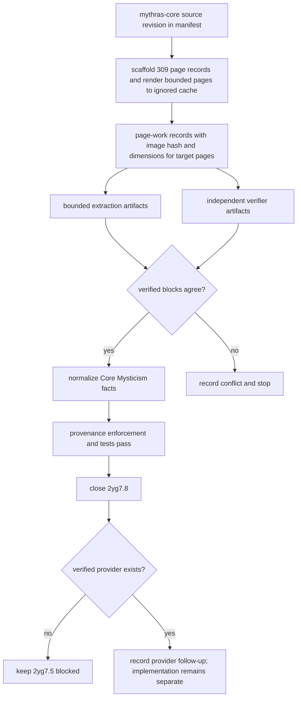

# fix: Verify Mythras Core Mysticism source pages

## Summary

Verify the Mythras Core Mysticism rule pages through the governed source-evidence workflow before any app-facing Mysticism behavior is allowed. The plan keeps Mysticism RAW mechanics separate from provider-based character access: this work can make `references/mythras-raw/mysticism.json` source-backed for Core rules, but it must leave Step 9 implementation blocked until a separate Bead verifies a cited Mysticism provider.

---

## Problem Frame

`references/mythras-raw/mysticism.json` currently contains legacy `pdftotext`-derived Mysticism data with `verified: false` and speculative `UNVERIFIED` skill bases. ADR-0013 now explicitly says Mysticism remains a target Mythras magic system, but not app-facing or implementable until the Core pages are independently verified and a source-backed access provider exists.

---

## Assumptions

*This plan was authored without synchronous user confirmation. The items below are agent inferences that fill gaps in the input — un-validated bets that should be reviewed before implementation proceeds.*

- The required rendered source page set is Mythras Core pages 155-161, plus page 196 as a boundary check for the existing `starting_at_chargen` claim; page 196 must have verification evidence that either supports the claim or records it as non-contributing/boundary-false.
- Because current validators require active source page manifests to enumerate every expected page once page records exist, the Mythras Core page-work update must scaffold all 309 page records while only rendering/verifying the bounded target pages.
- `mythras-chargen-2yg7.8` is source-verification work only. If a provider is discovered during this Bead, record the evidence and create or update a follow-up Bead; do not implement provider or app-facing behavior in `2yg7.8`.

---

## Requirements

- R1. Identify and verify the Mythras Core pages needed for chargen-relevant Mysticism rules.
- R2. Create bounded extraction artifacts and independent verification artifacts for verified pages without committing PDFs, rendered images, scratchpads, or full-page transcriptions.
- R3. Update `references/mythras-raw/mysticism.json` only from verified page/block evidence, removing speculative `UNVERIFIED` values from accepted app-facing Core facts.
- R4. Preserve ADR-0013's provider gate during this Bead: no generic Mysticism picker, no provider implementation, and no app-facing Mysticism implementation.
- R5. Extend proof coverage so source page-work, evidence joins, verifier independence, source-text budgets, provenance enforcement, and no-app-promotion state are enforced.
- R6. Keep Beads state durable: `mythras-chargen-2yg7.8` can close only after proof passes, and `mythras-chargen-2yg7.5` remains blocked if no Mysticism provider is verified.

---

## Scope Boundaries

- No `index.html` behavior changes, UI activation, agent API changes, PDF output changes, or handout changes are planned for this Bead.
- No source PDFs or rendered page images are committed.
- No full-page OCR/text extraction is committed.
- No source fact is promoted from legacy text-layer data alone.
- No unrestricted Core Mysticism talent list is exposed to character creation without a provider-specific source.
- Direct edits to `.beads/issues.jsonl` are out of scope; Beads CLI operations are authoritative and the JSONL file is updated only by export.

### Deferred to Follow-Up Work

- App-facing Mysticism implementation remains in `mythras-chargen-2yg7.5` after a verified source-backed provider exists.
- Any Kralori, Draconic, cult, order, school, species, culture, or career provider modeling belongs in a separate provider Bead even if evidence is discovered during this source verification work.

---

## Context & Research

### Relevant Code and Patterns

- `references/sources/manifest.json` records `mythras-core` as an active governed source revision with SHA-256, byte size, page count, render contract, Copyparty locator, and ignored local hint.
- `references/sources/pages/mythras-core.json` identifies Mysticism pages 155-161 but has no page records yet.
- Current source/page validators require active source page manifests to contain `expected_page_count` page records once page records exist, so a partial Mythras Core page list is not sufficient without changing validators.
- `references/mythras-raw/mysticism.json` is the target normalized Core reference and currently contains `verified: false` plus `UNVERIFIED` skill-base fields.
- `references/mythras-raw/magic-page-references.json` maps Mysticism sections to pages 155-161 and helps bound extraction.
- `references/sources/pages/waha.json`, `references/sources/evidence/waha/page-0001-extraction.json`, and `references/sources/evidence/waha/page-0001-verification.json` show the page-work, extraction, and verification artifact pattern to mirror.
- `references/sources/evidence/aig/page-0060-extraction.json` and `references/sources/evidence/aig/page-0060-verification.json` show current bounded evidence and independent verification conventions for governed sources.
- `scripts/render_source_pages.py`, `scripts/source_page_work_manifest.py`, `scripts/vision_page_workflow.py`, `scripts/source_manifest_validator.js`, and `scripts/validate_provenance.js` are the proof surfaces for this workflow.
- `references/provenance/legacy-disposition.json` currently exempts `references/mythras-raw/*.json`, so this plan must add explicit provenance enforcement for `references/mythras-raw/mysticism.json`.
- `test-chargen.js` already exercises source manifest, page-work, vision workflow, provenance, and source-attestation invariants.
- `.beads/issues.jsonl` is the exported durable Beads state and must record claim/close notes for `mythras-chargen-2yg7.8`.

### Institutional Learnings

- Vision/page evidence is the authority for governed source data; text-layer extraction is scratch-only.
- Bounded evidence may be committed without app-facing promotion, but promotion still requires normalized references, provenance, inline parity, and tests.
- Page-aligned extraction artifacts must be transformed into normalized domain JSON; page records and domain records should not be conflated.
- Source-text budgets are explicit constraints: bounded excerpts only, no full-page transcription.
- Cult type detection remains useful for cult providers, but higher-magic access must be source-backed and provider-scoped.
- Independent verifier context is mandatory; the verifier must not read extractor output, scratch, or rationale.

### External References

- None. The necessary constraints are repository-local ADRs, source manifests, page-work schema, and Beads acceptance criteria.

---

## Key Technical Decisions

- Verify mechanics before access: `mythras-chargen-2yg7.8` should make Core Mysticism rules source-backed, but it should not create a Mysticism access provider or alter character behavior.
- Include page 196 only as a boundary check: the current raw file cites it for starting/access context, so the implementation must verify whether that page supports the claim or explicitly mark the page/claim as non-contributing or blocked.
- Scaffold all Mythras Core page records rather than adding only the bounded target pages, because existing source/page-work validators require page count completeness for active sources.
- Treat page records as the source-evidence layer and `references/mythras-raw/mysticism.json` as the normalized domain layer; do not store domain conclusions only in page-work notes.
- Make tests fail closed on speculative Mysticism data, stale source revisions, missing verifier independence, oversized excerpts, missing provenance enforcement, and accidental app promotion.
- Separate Core-rule authority from app access in normalized data: use an explicit Core verification state and an app access state such as `blocked_no_verified_provider` so future code cannot treat Core verification as provider eligibility.
- Leave `mythras-chargen-2yg7.5` blocked if this work verifies RAW rules but finds no provider.

---

## Open Questions

### Resolved During Planning

- Should this work add a free Mysticism picker? No. ADR-0013 requires source-backed providers, and this Bead is source verification only.
- Should p.196 be trusted from the existing raw file? No. It must be rendered and independently verified as either supporting evidence or a non-contributing boundary page before the claim is retained.
- Can this plan add only bounded Mythras Core page records? No. Existing validators require an active source page manifest to enumerate all expected pages once records exist; U2 must scaffold all 309 records while rendering only the bounded target pages.
- Should Glorantha/Hannu notes be accepted by Core verification? No. Core-derived facts can be accepted here; non-Core notes need separate citations or remain advisory/blocked.

### Deferred to Implementation

- Exact page/block coordinates for each Mysticism fact depend on rendered page images.
- Whether p.196 contributes to the `starting_at_chargen` claim depends on direct page verification.
- Whether a Mysticism provider exists is not assumed; if discovered, it should become a source-backed provider follow-up and must not broaden this Bead into app work.

---

## High-Level Technical Design

> *This illustrates the intended approach and is directional guidance for review, not implementation specification. The implementing agent should treat it as context, not code to reproduce.*

---

## Implementation Units

### U1. Add Mysticism source-verification guards

**Goal:** Establish fail-closed tests and validations for the desired source-verification outcome before normalizing Mysticism data.

**Requirements:** R1, R3, R4, R5, R6

**Dependencies:** None

**Files:**
- Modify: `test-chargen.js`
- Read: `references/sources/schema.json`
- Read: `references/sources/pages/mythras-core.json`
- Read: `references/mythras-raw/mysticism.json`
- Read: `.beads/issues.jsonl`
- Test: `test-chargen.js`

**Approach:**
- Add targeted assertions for Mythras Core Mysticism page records covering pages 155-161 and the p.196 boundary decision.
- Require accepted Mysticism Core facts to avoid `UNVERIFIED`, `verified: false`, and speculative "likely" values.
- Require accepted facts to cite the current `mythras-core` source revision, page records, and verified block IDs.
- Require verifier independence and evidence joins between page-work, extraction blocks, verifier `verified_blocks`, and derived facts.
- Add no-app-promotion coverage so source verification alone does not imply a Mysticism picker, provider, or app behavior.
- Add coverage for explicit `core_rules_verified` versus `app_access_state: "blocked_no_verified_provider"` style state so Core verification cannot be read as provider eligibility.
- Add Beads-state coverage or a closeout verification note requirement that `mythras-chargen-2yg7.5` remains blocked absent a verified provider.

**Execution note:** Start characterization/test-first. The initial tests should fail against the current unverified Mysticism state and pass only after U2-U5 complete.

**Patterns to follow:**
- Existing AiG/Waha source-attestation tests in `test-chargen.js`.
- Existing source-text budget traversal in `test-chargen.js`.
- ADR-0013 provider-gating language.

**Test scenarios:**
- Happy path: verified Mythras Core Mysticism page records, artifacts, and normalized source refs satisfy all source-attestation checks.
- Edge case: p.196 is rendered but non-contributing; the starting/access claim remains blocked rather than accepted.
- Error path: any `UNVERIFIED`, `verified: false`, or speculative "likely" string in accepted Mysticism facts fails.
- Error path: an extraction block used by a derived fact is absent from verifier `verified_blocks`; the test fails.
- Error path: verifier run/prompt identity matches the extractor or lacks independence attestation; the test fails.
- Error path: source-text budgets exceed configured maxima or a full-page text artifact is committed; the test fails.
- Integration: `mythras-chargen-2yg7.5` is not treated as ready solely because Core rules were verified.
- Integration: `validate_provenance.js` fails if accepted Mysticism facts lack source refs or point at stale/unverified artifacts.

**Verification:**
- Tests clearly distinguish source-rule verification from provider/app promotion.
- Failing-state assertions point at the specific missing artifact, stale source revision, unsupported claim, or provider-block violation.

### U2. Scaffold and render Mythras Core page-work

**Goal:** Create validator-compatible page-work records for Mythras Core, rendering only the bounded Mysticism target pages while keeping rendered images ignored and source revision metadata stable.

**Requirements:** R1, R2, R5

**Dependencies:** U1

**Files:**
- Modify: `references/sources/pages/mythras-core.json`
- Read: `references/sources/manifest.json`
- Read: `references/mythras-raw/magic-page-references.json`
- Untracked local artifact: `.cache/source-pages/mythras-core/`
- Test: `test-chargen.js`

**Approach:**
- Confirm the ignored local Mythras Core PDF matches the manifest source revision, hash, byte size, and page count before rendering.
- Scaffold all 309 Mythras Core page records with pending/non-rendered state so existing source/page-work validators can accept the active source manifest.
- Render pages 155-161 and page 196 from the governed source revision.
- Record bounded target page-work entries with `pdf_page`, `printed_page_label`, source revision, render cache path, image hash, dimensions, renderer, DPI, work state, and contribution state.
- Keep `coverage_state` honest: bounded Mysticism pages may be rendered or verified while full Mythras Core coverage remains blocked.
- Stop if page labels or rendered content do not match the intended Mysticism/boundary pages.

**Patterns to follow:**
- `references/sources/pages/waha.json`
- `references/sources/pages/aig.json`
- `scripts/render_source_pages.py`

**Test scenarios:**
- Happy path: all 309 expected Mythras Core page records exist; non-target pages remain pending/non-rendered and target pages have matching source revision.
- Happy path: pages 155-161 and page 196 have relative cache paths, image hashes, dimensions, renderer, DPI, and matching source revision.
- Happy path: page 196 is present as contributing only if verification supports the current starting/access claim, otherwise it is explicitly non-contributing/boundary-false.
- Edge case: full Mythras Core coverage remains blocked even though bounded Mysticism pages are rendered or verified.
- Error path: source revision, PDF hash, page count, or rendered image hash mismatch fails validation.
- Error path: `.cache/source-pages/**/*.png` or source PDFs become tracked; git hygiene validation fails.

**Verification:**
- Page-work validates and no rendered images or PDFs appear in tracked files.

### U3. Produce bounded extraction and independent verification artifacts

**Goal:** Create source-text-budget-compliant extraction and independent verification artifacts for each contributing or boundary Mythras Core page.

**Requirements:** R1, R2, R5

**Dependencies:** U2

**Files:**
- Create: `references/sources/evidence/mythras-core/page-0155-extraction.json`
- Create: `references/sources/evidence/mythras-core/page-0155-verification.json`
- Create: `references/sources/evidence/mythras-core/page-0156-extraction.json`
- Create: `references/sources/evidence/mythras-core/page-0156-verification.json`
- Create: `references/sources/evidence/mythras-core/page-0157-extraction.json`
- Create: `references/sources/evidence/mythras-core/page-0157-verification.json`
- Create: `references/sources/evidence/mythras-core/page-0158-extraction.json`
- Create: `references/sources/evidence/mythras-core/page-0158-verification.json`
- Create: `references/sources/evidence/mythras-core/page-0159-extraction.json`
- Create: `references/sources/evidence/mythras-core/page-0159-verification.json`
- Create: `references/sources/evidence/mythras-core/page-0160-extraction.json`
- Create: `references/sources/evidence/mythras-core/page-0160-verification.json`
- Create: `references/sources/evidence/mythras-core/page-0161-extraction.json`
- Create: `references/sources/evidence/mythras-core/page-0161-verification.json`
- Create: `references/sources/evidence/mythras-core/page-0196-extraction.json`
- Create: `references/sources/evidence/mythras-core/page-0196-verification.json`
- Modify: `references/sources/pages/mythras-core.json`
- Test: `test-chargen.js`

**Approach:**
- Use separate extractor and verifier contexts. The verifier receives only rendered image/page metadata and schema constraints, not extractor output, scratch, or rationale.
- Require verifier artifacts to record their exact input artifact list, prompt hash or prompt ID, tool/model/agent identity, run ID, and an explicit assertion that no extraction JSON, extractor scratchpad, extractor rationale, or normalized conclusion was read.
- Create a claim-to-source map before normalization: every accepted skill, formula, mechanic, talent category, starting rule, or access rule must identify the exact source page/block that supports it.
- Extract only chargen-relevant Mysticism facts: skill bases, path/talent structure, starting mystic limits, activation/concentration mechanics, magnitude/intensity formulas, talent categories, and any p.196 access/start claim.
- Record block IDs, bounded excerpts, regions, excerpt hashes, source revision, rendered image hash, tool identity, prompt ID, run ID, and artifact kind.
- Record verification pass/fail per block, disagreements, and independence attestation.
- If the verifier disagrees on an app-facing fact, stop normalization and record the conflict in Beads notes.

**Patterns to follow:**
- `references/sources/evidence/waha/page-0001-extraction.json`
- `references/sources/evidence/waha/page-0001-verification.json`
- `references/sources/evidence/aig/page-0060-extraction.json`
- `references/sources/evidence/aig/page-0060-verification.json`
- `.decapod/OVERRIDE.md` subagent independence instructions.

**Test scenarios:**
- Happy path: each contributing page has extraction and independent verification artifacts with matching source revision and rendered image hash.
- Happy path: every derived fact block ID exists in extraction blocks and verifier `verified_blocks`.
- Edge case: p.196 is verified as non-contributing; extraction and verification artifacts record a boundary false rather than accepting the prior claim.
- Error path: an artifact omits block IDs, source revision, page number, image hash, region, or bounded excerpt; validation fails.
- Error path: a verifier artifact lacks independence attestation or shares extractor run identity; validation fails.
- Error path: any excerpt exceeds block/page/source budgets; validation fails.

**Verification:**
- Each artifact passes the vision workflow validator and the aggregate page-work manifest validation.

### U4. Normalize Core Mysticism reference data

**Goal:** Replace legacy speculative Mysticism data with verified Core facts, while clearly separating Core-rule authority, non-Core notes, and access-provider gaps.

**Requirements:** R1, R3, R4, R5

**Dependencies:** U3

**Files:**
- Modify: `references/mythras-raw/mysticism.json`
- Modify: `references/sources/pages/mythras-core.json`
- Optional modify: `references/mythras-raw/magic-page-references.json`
- Modify: `references/provenance/legacy-disposition.json`
- Test: `test-chargen.js`

**Approach:**
- Update only facts supported by verified blocks from U3.
- Remove accepted `UNVERIFIED` and speculative "likely" values.
- Add source authority metadata that ties accepted facts to `mythras-core`, the current source revision, page numbers, artifact paths, and verified block IDs.
- Add or update provenance disposition so `references/mythras-raw/mysticism.json` is explicitly governed by `mythras-core` source refs and scanned for unverified/speculative accepted values.
- Add explicit normalized state that distinguishes verified Core rules from app/provider readiness, such as `core_rules_verified: true` plus `app_access_state: "blocked_no_verified_provider"`.
- If a current claim cannot be verified from the scoped pages, mark it blocked or advisory rather than accepted.
- Keep AiG/Hannu/Glorantha notes separately cited or explicitly non-authoritative for this Core verification pass.
- Preserve a top-level state that accurately describes whether all app-facing Core Mysticism facts are verified; do not imply provider/app readiness.

**Patterns to follow:**
- `references/mythras-raw/animism.json`
- `references/mythras-raw/sorcery.json`
- `references/sources/pages/aig.json` derived-fact gating
- ADR-0013 provider-scoped access rule.

**Test scenarios:**
- Happy path: accepted Mysticism skills, formulas, mechanics, and talent structures cite verified source blocks.
- Happy path: non-Core notes remain advisory/blocked unless they have separate citations.
- Edge case: a verified mechanics file still records no source-backed Mysticism provider via explicit app access state; app access remains blocked.
- Error path: an accepted field lacks source authority metadata or points to an unverified block; validation fails.
- Error path: p.196-derived starting/access text remains accepted without p.196 support; validation fails.
- Error path: `validate_provenance.js` passes while accepted Mysticism facts lack evidence paths or source refs; the targeted regression should fail until provenance disposition is fixed.

**Verification:**
- `references/mythras-raw/mysticism.json` is internally consistent, source-cited, and free of accepted speculative values.

### U5. Prove no app promotion and close Beads state

**Goal:** Complete source verification without accidentally unblocking app-facing Mysticism, then make the Beads state durable through Beads CLI operations and export.

**Requirements:** R4, R5, R6

**Dependencies:** U4

**Files:**
- Generate by export: `.beads/issues.jsonl`
- Read: `index.html`
- Read: `references/provenance/`
- Test: `test-chargen.js`

**Approach:**
- Confirm no `index.html`, API, PDF, or handout behavior changed.
- Confirm existing Mysticism stubs remain non-promoted or source-blocked.
- Run the source/provenance/page-work/vision validators and the repository test harness.
- Update `mythras-chargen-2yg7.8` notes with page scope, artifacts, validator outcomes, p.196 disposition, no-app-promotion status, and `mythras-chargen-2yg7.5` blocker status.
- Use Beads CLI operations for all task-state changes, verify `mythras-chargen-2yg7.5` still has a blocking dependency or equivalent provider-gap blocker, check for dependency cycles, and export Beads to `.beads/issues.jsonl` before commit.

**Patterns to follow:**
- Recent AiG verification closeout Beads notes.
- `.decapod/OVERRIDE.md` proof gate list.
- ADR-0013 no-free-picker/provider gate.

**Test scenarios:**
- Happy path: source verification completes and `mythras-chargen-2yg7.8` closes with proof notes.
- Happy path: `mythras-chargen-2yg7.5` remains blocked with a clear provider-gap reason when no provider exists.
- Error path: any app-facing Mysticism surface appears without a provider; tests or review fail.
- Error path: Beads export omits the claim/close state; closeout fails.

**Verification:**
- Beads state and git diff show source evidence/reference/test changes only, plus generated Beads export updates.
- Decapod validation is run and any known control-plane failures are documented without claiming they are caused by this work.

---

## System-Wide Impact

- **Interaction graph:** Source manifest and page-work records feed evidence artifacts, normalized `references/mythras-raw/mysticism.json`, provenance validation, tests, and eventually app constants in a later Bead.
- **Error propagation:** Source mismatches, verifier disagreements, missing blocks, or budget violations should stop normalization rather than produce partial accepted data.
- **State lifecycle risks:** Page-work can be partially rendered/extracted/verified; normalized reference data should only mark accepted facts when all required blocks are independently verified.
- **API surface parity:** No agent API or browser UI behavior changes are in scope. If any app behavior changes, `node test-agent-api.mjs` and human-style browser QA become required.
- **Integration coverage:** `test-chargen.js` should connect page-work, extraction, verification, normalized facts, provider gating, and Beads state so no single layer can pass alone.
- **Unchanged invariants:** Source PDFs and rendered images stay untracked; Core rules verification does not imply source-backed Mysticism access.

---

## Risks & Dependencies

| Risk | Mitigation |
|------|------------|
| Mythras Core PDF hash, page count, or render output does not match the manifest | Stop before evidence creation and record the blocker on `mythras-chargen-2yg7.8`. |
| Page 196 does not support the existing starting/access claim | Mark the claim blocked/non-authoritative or record page 196 as non-contributing; do not accept it silently. |
| Verifier disagrees with extractor on skill bases or formulas | Stop normalization, record conflict, and require adjudication before accepting facts. |
| Evidence excerpts exceed source-text budgets | Reduce excerpts to bounded source snippets plus hashes/regions; do not commit full-page text. |
| Partial Mythras Core page records fail validators | Scaffold all 309 page records while only rendering/verifying bounded target pages. |
| Raw Core verification is mistaken for app implementation readiness | Explicit Core-rule/app-access states, tests, Beads notes, and ADR-0013 provider gates keep `2yg7.5` blocked without provider evidence. |
| Existing Mysticism stubs make app behavior look promoted | Audit and test for no new provider/access activation; defer quarantine if it requires app behavior changes beyond this Bead. |

---

## Documentation / Operational Notes

- No Copyparty sync is expected because this plan does not change mirrored player-facing files.
- Commit notes should cite `mythras-chargen-2yg7.8`, ADR-0013, and the final p.196 disposition.
- If implementation discovers a valid Mysticism provider, create or update a Bead with the full provider evidence context. Do not broaden `mythras-chargen-2yg7.8` into provider or app implementation.

---

## Sources & References

- Related Bead: `mythras-chargen-2yg7.8`
- Blocking implementation Bead: `mythras-chargen-2yg7.5`
- Related ADRs: `docs/adr/ADR-0013-source-backed-higher-magic-access.md`, `docs/adr/ADR-0009-source-artifact-lifecycle.md`, `docs/adr/ADR-0012-aig-bounded-vision-source-lifecycle.md`, `docs/adr/008-vision-source-authority.md`, `docs/adr/003-attestable-data-chain.md`, `docs/adr/ADR-0006-full-magic-system-coverage.md`
- Related source records: `references/sources/manifest.json`, `references/sources/pages/mythras-core.json`, `references/mythras-raw/mysticism.json`, `references/mythras-raw/magic-page-references.json`
- Related evidence patterns: `references/sources/pages/waha.json`, `references/sources/evidence/waha/page-0001-extraction.json`, `references/sources/evidence/waha/page-0001-verification.json`, `references/sources/evidence/aig/page-0060-extraction.json`, `references/sources/evidence/aig/page-0060-verification.json`
- Validation surfaces: `test-chargen.js`, `scripts/source_manifest_validator.js`, `scripts/source_page_work_manifest.py`, `scripts/vision_page_workflow.py`, `scripts/validate_provenance.js`
