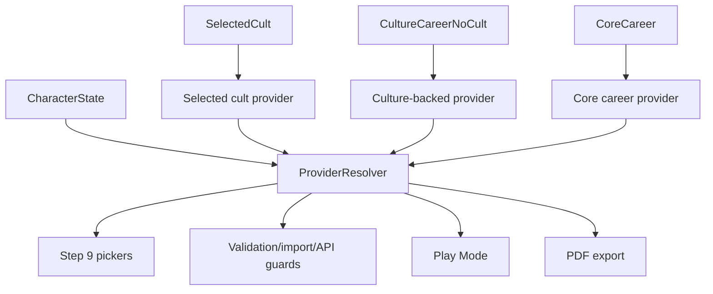

# feat: Implement independent magic providers

## Summary

Implement Animism, Sorcery, and Mysticism as independent chargen magic systems resolved through source-backed providers instead of treating selected cult as the only gate. The implementation should promote Mythras Core career-backed providers for Shaman, Sorcerer, and Mystic while preserving existing cult-backed providers and God Forgot/Zzistori culture-backed sorcery.

---

## Problem Frame

The chargen currently has strong support for cult-backed higher magic and a special no-cult Zzistori sorcery path, but parts of the code still conflate "magic system" with "selected cult". That has left Mysticism blocked after Core rule verification and makes Animism/Sorcery harder to reason about as independent Mythras systems.

---

## Assumptions

*This plan was authored in pipeline mode after the user clarified scope. The items below are implementation-shaping inferences that should remain visible during execution.*

- Mythras Core career data is a valid source-backed access provider: Shaman provides Core Animism, Sorcerer provides Core Sorcery, and Mystic provides Core Mysticism.
- Core career providers stack with unrelated cult providers because career selection is an independent character-creation source of training. If a selected cult provides the same magic system, the cult provider supersedes the Core career provider for that system only.
- Existing cult-backed and Zzistori provider behavior must remain backward compatible unless a specific test demonstrates it was already incorrect.
- Decapod validation/control-plane failures are not blockers for this work; project proof gates and Beads state are the actionable closeout authority.

---

## Requirements

- P1. Preserve origin full-magic coverage: Folk Magic, Rune Magic, Animism, Sorcery, and Mysticism all remain distinct Mythras systems.
- P2. Treat Animism, Sorcery, and Mysticism as independent systems whose chargen access can come from source-backed providers, not only selected cults.
- P3. Promote Mythras Core career-backed providers for Shaman, Sorcerer, and Mystic using existing Core career and magic-rule references.
- P4. Preserve cult-backed magic detection for Orlanth, Daka Fal, Waha, Arkat, and other one-pager cults.
- P5. Preserve God Forgot/Zzistori as culture-backed no-cult sorcery per ADR-0010.
- P6. Keep provider resolution fail-closed: no provider means no picker, no app-facing selections, and no hidden fallback list.
- P7. Make Step 9 UI, Play Mode, PDF export, and agent API expose the same provider-scoped magic state.
- P8. Maintain source/provenance chain from reference JSON to inline constants to UI/API/PDF tests.
- P9. Close or reclassify Beads that are blocked only by ignored Decapod validation issues, then unblock pregen refresh and final acceptance work.

**Origin requirement trace:** Origin R1/R2 map to P4/P7; origin R5/R9/R13 map to P2/P3/P7 for Animism; origin R6/R10/R14/R17 map to P2/P3/P5/P7 for Sorcery; origin R7/R11/R15 map to P2/P3/P7 for Mysticism; origin R16 remains preserved for cult-backed spell selection.

**Origin actors:** A1 Player, A2 GM/Hannu table style.
**Origin acceptance examples:** AE1 Orlanth theist, AE2 Daka Fal animist, AE3 Arkat sorcery, AE4 Waha hybrid.

---

## Scope Boundaries

- This plan does not add a generic "pick any higher magic system for free" control; every picker is still provider-backed.
- This plan does not implement full in-play spirit combat, sorcery shaping resolution, or mysticism talent activation mechanics beyond chargen selection and sheet display.
- This plan does not rewrite the single-file app architecture or introduce a build system.
- This plan does not treat Decapod container/todo validation failures as blockers, per current user instruction.

### Deferred to Follow-Up Work

- Provider expansion beyond current source-backed paths: add future mystic orders, sorcery schools, spirit traditions, or setting-specific providers as separate source-attested Beads.
- Full provider migration for saved-character schema: only add compatibility-preserving provider state needed for current flows in this pass.

---

## Context & Research

### Relevant Code and Patterns

- `index.html` contains the full app, inline constants, Step 9 UI, Play Mode, PDF export, and agent API.
- `index.html` already has `detectCultType()` for cult-skill classification and `resolveActiveSorcerySource()` / `resolveCultureBackedSorcerySource()` / `normalizeSorceryState()` for provider-like Zzistori sorcery behavior.
- `test-agent-api.mjs` already covers Orlanth, Daka Fal, Arkat, Waha, and Zzistori agent flows and is the strongest end-to-end proof surface for magic behavior.
- `test-chargen.js` is the public VM/source/provenance/PDF harness and should carry source-chain and utility-level provider tests.
- `references/mythras-raw/careers-detail.json` includes Core career skill lists for Shaman, Sorcerer, and Mystic.
- `references/mythras-raw/animism.json`, `references/mythras-raw/sorcery.json`, and `references/mythras-raw/mysticism.json` hold Core rules for the three independent systems.

### Institutional Learnings

- `docs/adr/ADR-0013-source-backed-higher-magic-access.md` chose provider-backed access rather than cult-only gating or free higher-magic pickers.
- `docs/adr/ADR-0010-culture-backed-sorcery-sources.md` models Zzistori as a source-backed school derived from culture/career/no-cult state, not a pseudo-cult.
- `docs/solutions/design-patterns/spirit-sorcery-picker-pattern.md` and related picker learnings recommend reusing checkbox picker mechanics while sharing provider/list/limit helpers so UI and validation cannot drift.
- `docs/solutions/design-patterns/dom-container-isolation-2026-05-19.md` warns that Step 9 magic pickers should render in isolated containers to avoid destroying sibling picker state.

### External References

- No external research is needed; this is governed by local ADRs, source references, and the user's current authority clarification.

---

## Key Technical Decisions

- Use "magic provider" internally and "Magic Source" in user-facing UI: this separates mechanical systems from cults, schools, careers, and traditions without introducing player-facing jargon.
- Keep `detectCultType()` cult-only: provider resolution should compose cult-backed, culture-backed, and career-backed access without turning cult detection into the global access authority.
- Add Core career-backed providers: Shaman resolves Animism, Sorcerer resolves Sorcery, and Mystic resolves Mysticism from Mythras Core references.
- Provider resolution should prefer more specific providers for the same system: selected cult provider first, then culture/career special case such as Zzistori, then Core career provider. Providers for unrelated systems stack; for example, a Mystic career with an Orlanth cult can expose Core Mysticism plus cult-backed Theism, while an Arkat cult supersedes generic Core Sorcery for a Sorcerer career.
- Preserve legacy state fields initially: `boundSpirits`, `sorcerySpells`, and new Mysticism fields can be normalized from active providers without forcing a broad save migration in this pass.
- Treat Decapod validation failures as non-blocking closeout notes only; do not leave Beads blocked solely because of `container_workspace_required` or Decapod todo policy mismatches.
- Model Core career provider records as derived app-access metadata that cites both `references/mythras-raw/careers-detail.json` and the relevant Core magic-rule JSON. Do not rewrite raw magic-rule chapters to imply that the chapter itself names the career provider.

---

## Open Questions

### Resolved During Planning

- Should lack of a non-Core cult/order provider block Mysticism? No. The user clarified Mythras Core is the provider; the implementation should use the Core Mystic career as the app-facing source-backed access path.
- Should higher magic become a free picker? No. ADR-0013's provider-backed model remains correct; this plan changes which providers exist, not the fail-closed rule.

### Deferred to Implementation

- Exact helper names for provider resolution: defer until editing `index.html` so names fit the current local style.
- Exact minimum Mysticism talent catalog shape: implementation must choose between a bounded verified talent/path picker or an explicitly informational v1. It must not expose unverified talent names or pretend a text-only stub satisfies a selectable talent workflow.

---

## High-Level Technical Design

> *This illustrates the intended approach and is directional guidance for review, not implementation specification. The implementing agent should treat it as context, not code to reproduce.*

Provider resolution should return a small list of active providers. Each provider should carry at least system, id, label, source kind, source refs, resource/limit metadata, and the list or rule needed by its picker. Existing single-system fields can remain as compatibility projections while the provider list becomes the shared source of truth. Same-system providers are mutually exclusive by precedence; unrelated-system providers stack.

---

## Implementation Units

### U1. Unblock Beads and create implementation tracking

**Goal:** Convert stale validation-only blocks into actionable Beads state and create provider implementation Beads with full context.

**Requirements:** P9

**Dependencies:** None; this unit should not block U2-U5 if Beads commands are temporarily noisy.

**Files:**
- Modify: `.beads/issues.jsonl`
- Test: `test-chargen.js`

**Approach:**
- Close or reclassify `mythras-chargen-s7c1`, `mythras-chargen-r4bx`, `mythras-chargen-vw0h`, and dependent documentation Beads if their only remaining blocker is ignored Decapod validation.
- Update `mythras-chargen-0t17` so it becomes ready once source-attestation blockers are actually closed.
- Create a parent feature Bead for independent magic providers and child Beads for source/provenance alignment, provider resolver, UI/API/PDF integration, Mysticism implementation, pregens, Copyparty sync, and final review.
- Include the current user clarification in Bead notes: Decapod issues are non-blocking and Mythras Core is a valid Mysticism provider.

**Execution note:** Do this before code changes so subagents and future sessions have durable scope.

**Patterns to follow:**
- Beads workflow and fan-out prompt rules from the repo override: use `bd`, include enough context for subagents, and treat Decapod validation failures as non-blocking by current user instruction.
- Existing Beads notes on `mythras-chargen-w6si`, `mythras-chargen-2yg7.5`, `mythras-chargen-s7c1`, and `mythras-chargen-r4bx`.

**Test scenarios:**
- Test expectation: none for Beads mutations themselves, but `test-chargen.js` should still pass after `.beads/issues.jsonl` export because the repository treats Beads state as committed context.

**Verification:**
- `bd list --ready` exposes the next actionable implementation or pregen Bead rather than hiding behind Decapod-only blockers.

---

### U2. Align source and provenance metadata for Core providers

**Goal:** Add or update source-backed provider reference data so Core career providers can be mirrored into app constants without inventing inline-only facts.

**Requirements:** P2, P3, P8

**Dependencies:** None

**Files:**
- Modify: `references/mythras-raw/mysticism.json`
- Modify: `references/mythras-raw/animism.json`
- Modify: `references/mythras-raw/sorcery.json`
- Modify: `references/mythras-raw/careers-detail.json`
- Modify: `references/provenance/index-html-map.json`
- Modify: `references/provenance/index-html-coverage.json`
- Modify: `references/provenance/legacy-disposition.json`
- Test: `test-chargen.js`

**Approach:**
- Replace Mysticism's blocked app-access metadata with derived source-backed Core career provider metadata.
- Add explicit provider records or provider metadata for Shaman, Sorcerer, and Mystic that cite both Core careers and the relevant Core magic-rule reference.
- Keep raw chapter claims factual: Animism, Sorcery, and Mysticism rule files can cite provider metadata, but the provider itself is a cross-source app-access inference from Core career plus Core magic-rule references.
- Keep provider facts compact and reference-backed; do not add full page transcriptions or unverified talent/spell/spirit content.
- Update provenance maps so any new inline provider constants trace back to reference JSON.

**Execution note:** Start test-first with source/provenance assertions before editing inline app constants.

**Patterns to follow:**
- `references/aig-raw/culture-magic-profiles-aig.json` for provider-shaped source metadata.
- Existing `references/mythras-raw/mysticism.json` source-ref structure for verified Core Mysticism evidence.

**Test scenarios:**
- Happy path: Core Shaman, Sorcerer, and Mystic provider records exist in references and cite both career and magic-rule sources.
- Error path: Mysticism may not be marked `blocked_no_verified_provider` after Core career provider metadata exists.
- Integration: provenance validation covers each app-facing provider constant path.

**Verification:**
- Provider reference data is source-backed, bounded, and mirrored through provenance before UI use.

---

### U3. Introduce shared higher-magic provider resolution

**Goal:** Centralize access resolution for Animism, Sorcery, and Mysticism so Step 9, validation, Play Mode, PDF, and agent API use the same provider set.

**Requirements:** P2, P4, P5, P6, P7

**Dependencies:** U2

**Files:**
- Modify: `index.html`
- Test: `test-chargen.js`
- Test: `test-agent-api.mjs`

**Approach:**
- Add a shared provider resolver near the existing sorcery source resolver.
- Preserve `detectCultType()` as the selected-cult provider classifier.
- Adapt current Zzistori resolver into the shared provider shape without changing its externally visible behavior.
- Add Core career provider resolution for Shaman, Sorcerer, and Mystic.
- Allow unrelated providers to stack and same-system providers to use precedence. Test cases must cover `Sorcerer + Orlanth`, `Shaman + Orlanth`, `Mystic + Orlanth`, and same-system cult-over-career cases such as `Sorcerer + Arkat`.
- Normalize legacy fields from active providers and clear invalid selections fail-closed.

**Execution note:** Add characterization tests for current Orlanth, Daka Fal, Waha, Arkat, and Zzistori flows before replacing call sites.

**Patterns to follow:**
- `resolveCultureBackedSorcerySource()`, `resolveCultBackedSorcerySource()`, and `normalizeSorceryState()`.
- Existing atomic rejection behavior in agent API and import/localStorage tests.

**Test scenarios:**
- Happy path: Daka Fal still resolves cult-backed Animism, Arkat still resolves cult-backed Sorcery, Waha still resolves hybrid Theism+Animism, and Zzistori still resolves no-cult Sorcery.
- Happy path: Shaman with No Cult resolves Core Animism, Sorcerer with No Cult resolves Core Sorcery, and Mystic with No Cult resolves Core Mysticism.
- Happy path: Shaman/Sorcerer/Mystic with an unrelated cult resolves both the cult provider and the Core career provider.
- Edge case: selected cult provider for a system takes precedence over the generic Core career provider for the same system.
- Error path: invalid or stale provider selections are rejected or cleared through the same rules as existing sorcery-source transitions.

**Verification:**
- All app surfaces can ask for active providers without duplicating cult/career/culture logic.

---

### U4. Update Step 9 UI and validation for provider-scoped pickers

**Goal:** Render provider-backed pickers in Step 9 for independent Animism, Sorcery, and Mysticism while preserving existing cult selection UX.

**Requirements:** P1, P2, P3, P4, P5, P6, P7

**Dependencies:** U3

**Files:**
- Modify: `index.html`
- Test: `test-agent-api.mjs`
- Test: `test-chargen.js`

**Approach:**
- Keep No Cult and cult cards, but add an "Available Magic Sources" section derived from provider resolution.
- Reuse existing spirit and sorcery picker components where possible, parameterized by provider.
- Replace the Mysticism stub with a Core Mysticism panel for Mystic career: path label, Meditation/Mysticism skills, Magic Points as activation resource, starting talent limit, and source badge.
- If verified talent/path data is sufficient for a bounded picker, expose it and test selections. If not, ship Mysticism v1 as explicitly informational with no unverified talent picker and create a follow-up Bead for bounded talent catalog normalization.
- Validate selections against the provider that exposed them; do not allow global lists without provider authority.

**Execution note:** Implement new UI behavior test-first in `test-agent-api.mjs` because Step 9 behavior spans browser state, controls, and validation.

**Patterns to follow:**
- `App.renderSorceryPickerPanel()`
- `App.toggleSpirit()`
- `App.getStep9ValidationErrors()`
- Existing No Cult Zzistori panel layout.

**Test scenarios:**
- Happy path: Shaman No Cult shows Core Animism source and spirit picker/slot information without requiring a cult.
- Happy path: Sorcerer No Cult shows Core Sorcery source and spell picker without requiring Arkat or Zzistori.
- Happy path: Mystic No Cult shows Core Mysticism source, Magic Points activation resource, and Mysticism/Meditation chargen limits.
- Happy path: Mystic with an unrelated cult still shows Core Mysticism alongside the cult-backed provider.
- Edge case: non-magic careers with No Cult show no higher-magic provider picker.
- Error path: selecting a spirit/spell/talent not offered by the active provider fails validation.
- Integration: switching away from a magic career with selections either blocks in API/import or clears with user-visible browser confirmation.

**Verification:**
- Step 9 displays independent systems through explicit providers and no longer leaves Core Mysticism invisible solely because no cult is selected.

---

### U5. Integrate providers into Play Mode, PDF export, and agent API

**Goal:** Ensure every user-visible and agent-visible surface reflects the same provider-backed magic state.

**Requirements:** P7, P8

**Dependencies:** U3, U4

**Files:**
- Modify: `index.html`
- Test: `test-agent-api.mjs`
- Test: `test-chargen.js`

**Approach:**
- Extend Play Mode magic rendering to show provider label, system, resource/limit, source, and selected items for Core career providers.
- Ensure Mysticism UI/PDF/API text says Talents use Magic Points when activated and uses Meditation/Mysticism only for limits; do not reuse stale "no MP cost" copy.
- Extend PDF export to include Core Animism, Core Sorcery, and Core Mysticism sections when active.
- Extend `App.agent.getState()`, `App.agent.getOptions(9)`, and `App.agent.getMagicState()` to expose active providers while preserving legacy fields for existing tests and callers.
- Add agent actions or payload support for Mysticism selections if the minimal Mysticism model includes user choices.

**Execution note:** Keep API changes backward compatible and add tests for both legacy and provider-shaped state.

**Patterns to follow:**
- Current Play/PDF separation for cult-backed magic and no-cult Zzistori sorcery.
- Existing `App.agent.getMagicState()`, `assertSpellCount()`, and `assertSpiritSlots()` patterns.

**Test scenarios:**
- Happy path: Play Mode and PDF for Shaman/Sorcerer/Mystic No Cult display the Core provider and correct system details.
- Happy path: Play Mode and PDF for Mystic show Magic Points activation resource and do not claim "no MP cost."
- Happy path: existing Orlanth, Daka Fal, Waha, Arkat, and Zzistori Play/PDF/API assertions remain valid.
- Error path: agent API rejects provider payloads with unknown provider ids, duplicate selections, inherited arrays, or items outside the provider list.
- Integration: imported/saved characters cannot retain magic selections after provider eligibility is lost.

**Verification:**
- UI, PDF, and agent API are provider-parity surfaces rather than separate cult-specific implementations.

---

### U6. Refresh pregens, publish player-facing files, and close acceptance gates

**Goal:** Use the unblocked source state to refresh active pregens, publish changed player-facing files, and close Beads that no longer have actionable blockers.

**Requirements:** P9

**Dependencies:** U1, U2, U3, U4, U5

**Files:**
- Modify: `.beads/issues.jsonl`
- Modify: `index.html`
- Modify: active pregen PDFs or source inputs only if the refresh proves they are stale
- Test: `test-chargen.js`
- Test: `test-agent-api.mjs`

**Approach:**
- After source/provider implementation passes, claim `mythras-chargen-0t17` or its successor and regenerate/review active Copyparty pregens if their mechanics are stale.
- Sync `index.html` to `/w/01-Character-Generator.html` when app behavior changes.
- Sync active pregen PDFs only when their content changes.
- Close `mythras-chargen-1qu0` or update it with only genuinely actionable remaining work.

**Execution note:** Use human-style agent-browser QA after `index.html` changes before closing player-facing Beads.

**Patterns to follow:**
- Repo override Copyparty publish and verification paths: `/w/01-Character-Generator.html` for `index.html`, active pregens under `/w/characters/active-pregens/`, and URL verification after sync.
- Existing `test-agent-api.mjs` local server harness.

**Test scenarios:**
- Integration: public character generator URL serves the updated app after sync.
- Integration: changed pregen PDFs, if any, display provider-correct magic resources.
- Error path: if pregen refresh discovers bad data, create/claim a new Bead and fix it in-flight rather than blocking without action.

**Verification:**
- Ready Beads are either implemented/closed or contain only concrete next actions, not Decapod-control-plane blockers.

---

## System-Wide Impact

- **Interaction graph:** Provider resolution affects Step 9 rendering, selection toggles, validation, import/localStorage, Play Mode, PDF export, and agent API.
- **Error propagation:** Invalid provider state should fail through existing validation/API errors rather than silently clearing user selections outside explicit confirmation flows.
- **State lifecycle risks:** Culture, career, and cult changes can invalidate providers; implementation must preserve existing anti-loss confirmation and atomic rejection patterns.
- **API surface parity:** Agent API must see the same provider state that the browser UI and PDF use.
- **Integration coverage:** Browser/API tests are required because unit tests alone will not prove Step 9 re-rendering, Play Mode, and PDF behavior.
- **Unchanged invariants:** Existing theist Devotional Pool rules, cult-backed animism/sorcery, and Zzistori no-cult sorcery should remain compatible.

---

## Risks & Dependencies

| Risk | Mitigation |
|------|------------|
| Core career providers accidentally become unrestricted free higher-magic access | Gate providers on matching Core magic careers and explicit derived provider metadata; unrelated cults do not suppress career providers, but same-system cult providers supersede them. |
| Provider resolver breaks existing cult-backed behavior | Add characterization coverage for Orlanth, Daka Fal, Waha, Arkat, and Zzistori before migration. |
| Mysticism implementation invents unverified talent data | Use only verified Core Mysticism reference fields; if the catalog is not sufficient, expose informational v1 and create a follow-up Bead for bounded talent catalog normalization. |
| UI and validation drift | Derive pickers, limits, Play, PDF, and API from the same provider resolver. |
| Beads remain blocked by stale Decapod notes | Close/reclassify Decapod-only blocks and record user instruction that those issues are non-blocking. |
| Player-facing files drift from local app | Sync changed mirrored files to Copyparty and verify public URLs before closing publication Beads. |

---

## Documentation / Operational Notes

- Update ADR-0013 and ADR-0006 amendments if implementation changes their current Mysticism blocked language.
- Record the user clarification in Beads notes so future sessions do not reintroduce Decapod validation or non-Core-provider blockers.
- Run source/provenance validators after reference/provenance changes.
- Run `node test-chargen.js` and `node test-agent-api.mjs` after app/magic changes.
- Run `./scripts/ingest-cults.py --validate` if cult/reference extraction data changes.
- Run agent-browser QA after `index.html` changes.
- Run `decapod validate` only as a non-blocking diagnostic unless the user changes the current policy.

---

## Sources & References

- **Origin document:** [docs/brainstorms/full-magic-system-coverage-requirements.md](../brainstorms/full-magic-system-coverage-requirements.md)
- **Architecture decisions:** [docs/adr/ADR-0006-full-magic-system-coverage.md](../adr/ADR-0006-full-magic-system-coverage.md), [docs/adr/ADR-0010-culture-backed-sorcery-sources.md](../adr/ADR-0010-culture-backed-sorcery-sources.md), [docs/adr/ADR-0013-source-backed-higher-magic-access.md](../adr/ADR-0013-source-backed-higher-magic-access.md)
- **Core provider sources:** [references/mythras-raw/careers-detail.json](../../references/mythras-raw/careers-detail.json), [references/mythras-raw/animism.json](../../references/mythras-raw/animism.json), [references/mythras-raw/sorcery.json](../../references/mythras-raw/sorcery.json), [references/mythras-raw/mysticism.json](../../references/mythras-raw/mysticism.json)
- **Current app surfaces:** [index.html](../../index.html), [test-chargen.js](../../test-chargen.js), [test-agent-api.mjs](../../test-agent-api.mjs)
